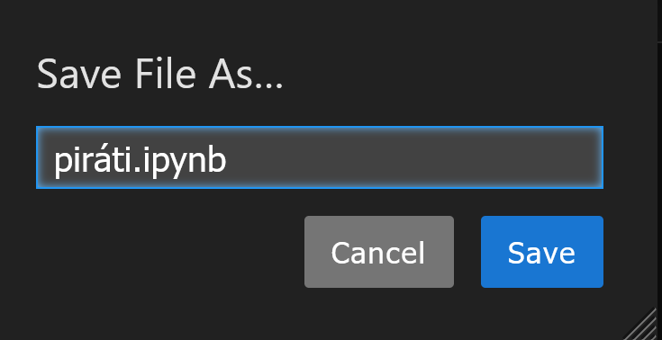

# První spuštění, jednoduchá kalkulačka

## Nejdůležitější poznatky

Čtenář tohoto textu by si z něj měl odnést zejména následující poznatky:

- jak spustit Python interpretr
- jak spustit Jupyter, jak v něm založit nový notebook

Tyto poznatky budou užitečné již v následující kapitole.

## Spuštění příkazové řádky a Pythonu

Pokud chceš spustit Python, je několik způsobů jak to udělat. Jedním z nich je spustit ho pomocí
příkazové řádky.

Prvním krokem je spustit samotnou příkazovou řádku. Příkazová řádka je program, který ti umožní
jednoduchou interakci s **operačním systémem** tvého počítače. 

Příkazovou řádku spustíš tak, že v menu `Start` spustíš program *Příkazový* *řádek*.

- klikni myší na dlaždici Windows (start) v levém dolním rohu obrazovky
- začni psát - napiš `cmd`, a stiskni klávesu Enter

Celé by to mělo vypadat nějak takhle:


Pokud se ti to podařilo, mělo by tě přivítat "černé okno". Vypadá nějak takhle 
(na tvém počítači asi bude vypadat trochu jinak).


V tomto černém okně můžeš nyní zadávat příkazy, kterém rozumí tvůj počítač.
Jedním z nich může být například spuštěnní Python interpretru.

Napiš do příkazové řádky příkaz `python`, a stiskni klávesu Enter. Pokud se vše podařilo, 
měl bys vidět okno, které vypadá zhruba takhle. Všimni si "tří zobáčků" ve spodní části 
obrazovky.


Tyto tři zobáčky jsou výzvou, abys zadal instrukci, které Python rozumí.

Zkusíme si teď spočítat jednoduchý příklad.

**Zadání**:

- mějme 128 pirátů
- standardní pirátská loď potřebuje k svojí obsluze kapitána, kormidelníka, a 14 lodníků
- jak velkou flotilu dokáže 128 pirátů vytvořit? Kolik lodí dokážou obsadit?

Zkus tento příklad spočítat v Python interpretru - prostě zadej následující příkaz:

```python
128 / (14 + 1 + 1)
```

Mohlo by to vypadat nějak takhle:


- na jednu loď potřebujeme 14 námořníků, plus kormidelníka, plus kapitána, to je `(14 + 1 + 1)` pirátů
- 128 pirátů dokáže tedy obsadit `128 / (14 + 1 + 1)` lodí, což je 8 lodí

Python interpretr dokáže tíhle způsobem přijmout jakýkoliv příkaz z jazyku Python. 
Pochopitelně, tímto způsobem nebudeš psát složitější programy - ale pro jednoduché úlohy to může stačit,
a v každém případě je dobré vědět, jak interpretr spustit.

Dobře, přišel čas interpretr vypnout. K tomu slouží příkaz `exit()`. Zadej ho interpretru.

Mohlo by to vypadat nějak takhle:


A jsi zpátky v příkazové řádce. Zatím ji nevypínej, zkusíme si na ní ještě něco.

Je důležité také vědět, že tento interpretr spouští **jakýkoliv** program napsaný v programovacím jazyku
Python.

## Spuštění Jupyter notebooku

Pro rychlé experimenty se může velmi hodit program nazvaný [Jupyter](https://jupyter.org/).
Jupyter je takový "lepší interpretr" jazyka Python. S jeho pomocí můžeš zadávat instrukce
pro interpretr mnohem pohodlněji, než s pomocí základního interpretru dostupného z příkazové 
řádky.

Přesnější by vlastně asi bylo říct, že je Jupyter nadstavba nad běžným interpretrem Pythonu.
Na pozadí ho používá, ale nabízí ti mnohem lepší možnosti, jak s Pythonem pracovat pomocí
jednotlivě zadávaných příkazů.

Zkus v konzoli zadat následující sekvenci příkazů:

Zadej `cd \git\pylab` - tímto příkazem se přepneš do adresáře `pylab`, ve kterém budeme spolu nadále pracovat.
O tom, co to je adresář, si povíme něco víc později.

Mohlo by to vypadat nějak takhle:


Dále zadej příkaz `jupyter lab`, a stiskni Enter. Tím svému počítači říkáš, že chceš spustit program Jupyter.
Zkus si tento příkad zapamatovat, budeš ho používat docela často.

V černém okně proběhne tajná zašifrovaná zpráva. Mohlo by to vypadat nějak takhle:


Současně se ti spustí internetový prohlížeč, a v jeho okně bude spuštěný Jupyter. Hurá.
Mohlo by to vypadat nějak takhle:


To nám prozatím stačí.

## Nový notebook

Zkusíme si teď vytvořit nový "poznámkový blok", ve kterém si vyřešíme příklad s piráty.

V levé části okna (viz obrázek) dvakrát rychle po sobě klikni na `kapitola-01`, aby ses do adresáře přepnul.


Pokud by ses potřeboval "vrátit zpátky, slouží k tomu ikonka složky, které je na obrázku obtažená červeným kroužkem.

Zkus se přepnout do adresáře `kapitola-01`, vrať se z něj, a pak se přepni znovu do adresáře `kapitola-01`, čistě proto, 
abys viděl, jak to funguje.

Teď přišel čas založit nový notebook.

V prostřední části okna klikni na ikonku v sekci `Notebook` s nápisem `Python 3`. Viz následující obrázek.


Spustí se ti nový, zatím nepojmenovaný notebook. Vypadá nějak takhle:


Něco si o něm nyní povíme.

Zaprvé, všimni si že notebook obsahuje jednu buňku, do které je možné zadat příkaz jazyku Python.
Je to takový ten modrý rámeček vpravo. Klikni na něj, a napiš do něj následující příkaz.

```python
piratu_celkem = 128
```
Potom stiskni `Shift+Enter` - spustíš tím buňku, do které jsi právě ten příkaz zadal, a současně se ti vytvoří nová, 
prázdná buňka pod ní. Mohlo by to vypadat nějak takhle:


Do další buňky zadej, kolik piratu se vejde na jednu loď. Je to 14 lodníků, 1 kormidelník, a 1 kapitán.
Opět potvrď svůj příkaz stiskem `Shift+Enter`, abys ho spustil.

```python
piratu_na_lod = 14 + 1 + 1
```

Nyní můžeš vypočítat, kolik lodí bude ve flotile. Do další (třetí) buňky zadej tento příkaz, a 
opět potvrď stiskem kláves `Shift+Enter`.

```python
lodi = piratu_celkem / piratu_na_lod
```

Na poslední buňku zadej příkaz pro zobrazení počtu lodí ve flotile. Opět potvrď pomocí klávesy `Shift+Enter`.
O příkazu (funkci) `print` si něco povíme později, v dalších kapitolách.

```python
print("Ve flotile bude celkem", lodi, " lodí")
```

Mohlo by to celé vypadat nějak takhle:


Právě jsi napsal svůj první program v jazyce Python!

... ale co když pirátů bude celkem 144, a ne 128? Jak výpočet zopakovat?

Jednoduše. Klikni na **první** buňku, a oprav příkaz který tam je zadaný takto, a opět stiskni `Shift+Enter`, abys ho potvrdil.

```python
piratu_celkem = 144
```

Nyní máš dvě možnosti jak zopakovat celý výpočet: buď budeš potvrzovat příkazy buňku za buňkou, a necháš je postupně vykonat, nebo
spustíš celý notebook znovu, od začátku. Jupyter na to má tlačítko, mohlo by to vypadat jako na následujícím obrázku.
Tlačítko, které máš stisknout, jsem obtáhnul červeným kroužkem.


Jupyter se tě teď zeptá, jestli to myslíš vážně. Potvrď mu, že ano. Prostě zmáčkni ten červený knoflík s nápisem Restart
(kdo by neměl rád velká červená tlačítka?)


Chvilku to trvá, ale nakonec se dozvíš správný výsledek.


## Jak uložit notebook?

Nakonec si notebook uložíme. Nejrychlejší způsob, jak to udělat, je stisknout `Ctrl+S`. Alternativně můžeš 
v menu v horní liště zvolit `File`, a potom `Save notebook` (což znamená něco jako Soubor / Uložit notebook).

Jupyter tě vyzvá k zadání názvu tohoto notebooku. Nazvi ho `piráti.ipynb`.
Ta koncovka, `.ipynb`, je docela důležitá, a **každý notebook který založíš by ji měl obsahovat**.

Potvrď nové jméno stisknutím modrého tlačítka `Rename`.



## Jak ukončit Jupyter?

Pamatuješ si na to "černé okno"? Tak nejrychlejší způsob, jak Jupyter ukončit, je to černé okno zavřít. Nebo,
pokud se chceš vrátit do příkazové řádky, stiskneš v něm klávesovou zkratku `Ctrl+C`, a tím Jupyter ukončíš.

Mohlo by to vypadat nějak takhle:


Zkus si ho takhle ukončit, a spustit znovu (`jupyter lab`).
