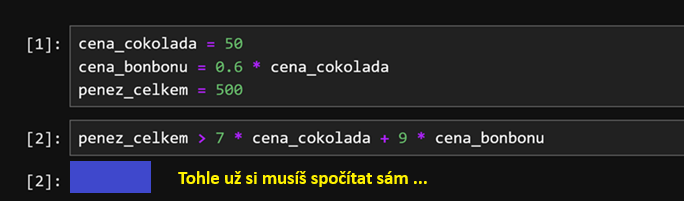
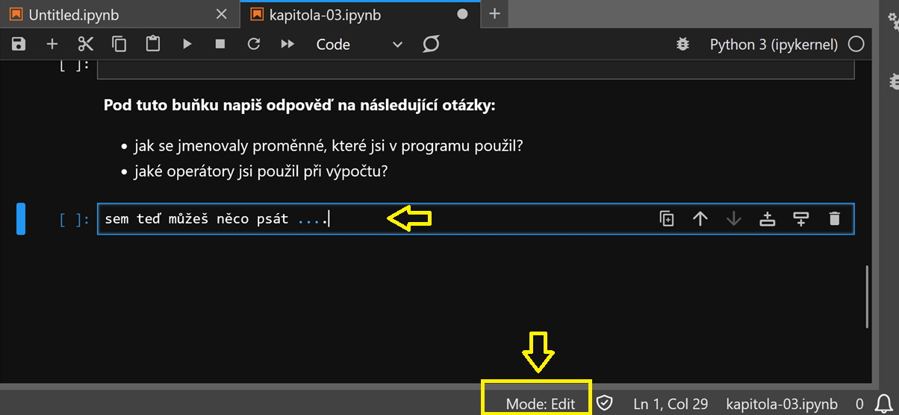
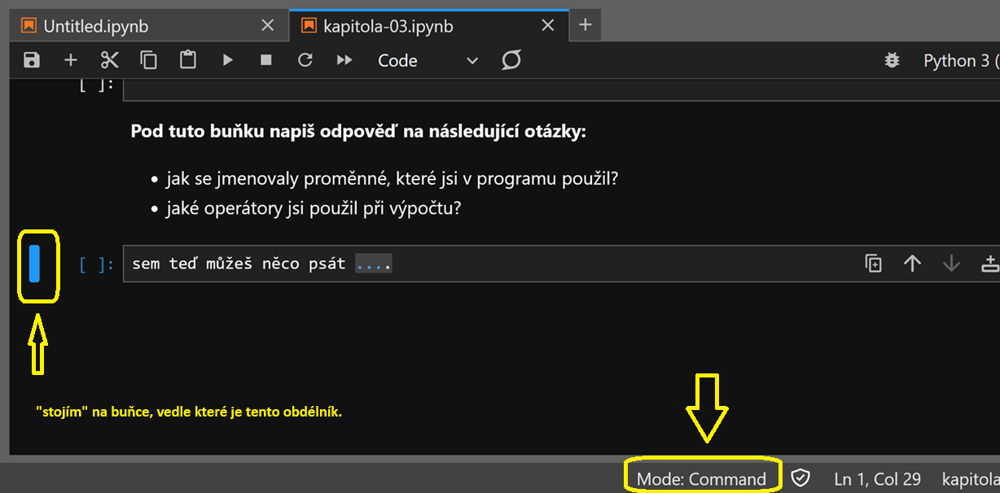
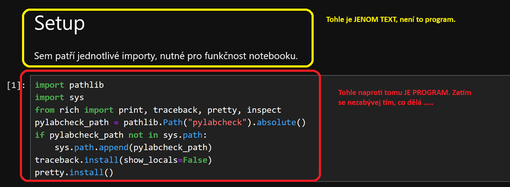
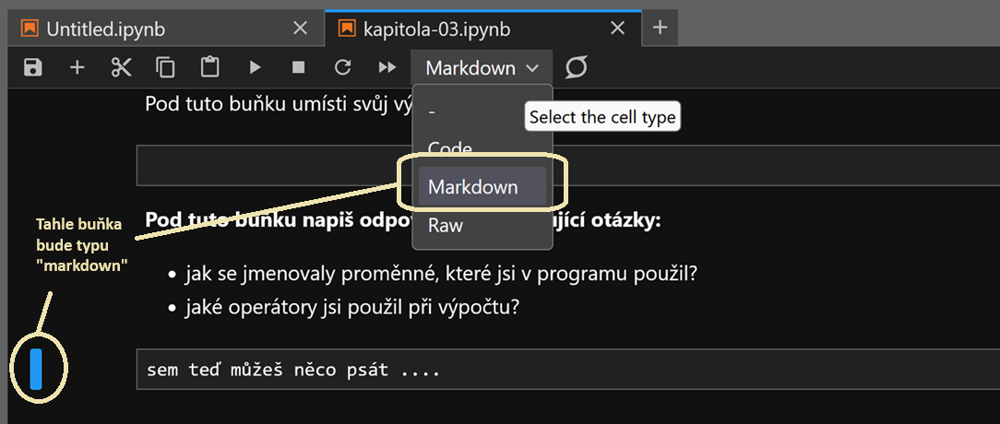

- [Kapitola 03: Proměnné a jednoduché datové typy](#kapitola-03-proměnné-a-jednoduché-datové-typy)
  - [Nejdůležitější poznatky](#nejdůležitější-poznatky)
  - [Proměnné: přiřazení hodnoty do proměnné](#proměnné-přiřazení-hodnoty-do-proměnné)
      - [Co je to proměnná: hodnotu ukládáme do paměti](#co-je-to-proměnná-hodnotu-ukládáme-do-paměti)
      - [Pravidla pro názvy proměnných](#pravidla-pro-názvy-proměnných)
      - [Pojďme si to vyzkoušet v praxi](#pojďme-si-to-vyzkoušet-v-praxi)
      - [Experiment 1](#experiment-1)
      - [Experiment 2: editační módy notebooku](#experiment-2-editační-módy-notebooku)
      - [Experiment 3: odlišné typy buněk](#experiment-3-odlišné-typy-buněk)
      - [Experiment 4: přesun buňky](#experiment-4-přesun-buňky)
  - [Proměnné: získání hodnoty proměnné](#proměnné-získání-hodnoty-proměnné)
  - [Co když proměnná na kterou chci přistupovat ještě neexistuje?](#co-když-proměnná-na-kterou-chci-přistupovat-ještě-neexistuje)
  - [Jak se podívat na hodnotu na kterou proměnná odkazuje?](#jak-se-podívat-na-hodnotu-na-kterou-proměnná-odkazuje)
    - [Print](#print)
    - [Reprezentace (repr)](#reprezentace-repr)
  - [Přišel čas na první commit](#přišel-čas-na-první-commit)
- [Zdroje](#zdroje)
  - [Anglicky](#anglicky)

# Kapitola 03: Proměnné a jednoduché datové typy

## Nejdůležitější poznatky

- proměnná je "štítek", který vede k nějaké hodnotě
- jak se rychle pohybovat po notebooku, a zakládat/rušit buňky
- v notebooku existují buňky dvou typů: buňky typu `Code`, které obsahují tvůj program, a `Markdown`, které obsahují dokumentaci
- v Pythonu je možné použít příkaz (vestavěnou funkci) `print`, který "vypíše" na výstup to, co jsi mu předal jako parametr (nebo parametry)
- příkaz `print` není jediný způsob, jak se na nějakou proměnnou podívat
- názvy proměnných: `snake_case`, nikoliv `PascalCase` ani `camelCase`; tohle je `KONSTANTA`

## Proměnné: přiřazení hodnoty do proměnné

V [první kapitole](./../kapitola-01/readme.md) jsi řešil jednoduchý příklad s výpočtem velikosti flotily.
Psal jsi v něm kód, který vypadal nějak takhle:

```python
piratu_celkem = 128
piratu_na_lod = 14 + 1 + 1
lodi = piratu_celkem / piratu_na_lod
print("Ve flotile bude celkem", lodi, " lodí")
```

Podívej se na první řádek tohoto programu. Myslím si, že na první pohled intuitivně chápeš, "co tato instrukce dělá".

```python
piratu_celkem = 128
```

Pojďme si to nyní rozebrat.

- v kódu se v levé části objevuje název proměnné, `piratu_celkem`
- vpravo od něj je použito "rovnítko" (`=`), což je **operátor** přiřazení; Python interpretru tím říkáme,
  že do proměnné `piratu_celkem` má přiřadit hodnotu, která je vpravo za rovnítkem
- vpravo od rovnítka je uvedená číselná hodnota 128

Na těchto třech výrocích můžeme nyní demonstrovat několik důležitých principů, kterými se Python řídí.

#### Co je to proměnná: hodnotu ukládáme do paměti

Vzpomínáš si na druhou kapitolu, kde jsme si představili princip [von Neumannovy architektury?](../kapitola-02/readme.md##von-neumannova-architektura).
Tak ten princip je ve skutečnosti docela důležitý.

Každá **hodnota**, ať už to je číslo, nebo text, se kterou tvůj program nějak zachází, je uložená v **paměti** počítače.
Musí to tak být. Koneckonců, i ty, pokud chceš vědět, kdy dostaneš příští dárek k svátku, nebo k narozeninám (a ano, asi to
bude nějak souviset s [hustou melou](https://www.zatrolene-hry.cz/spolecenska-hra/husta-mela-2762/), musíš zapátrat v paměti,
kdy že to zatraceně ten svátek máš.

A když si vzpomínáš, kdy že to bude, musíš si uvědomit, že hledáš datum svého svátku.

V téhle analogii:

- datum je **hodnota**
- a fakt, že jde o svátek, a ne o narozeniny, je **proměnná**

Nebo ještě jinak a možná lépe.

```
  ┌────────────────────────────────────────┐
  │                                        │
  │  PAMĚŤ (RAM) jako skladiště            │
  │  ---------------------------------     │
  │  Každý box je papírová krabice.        │
  │  Představuje určitou část paměti.      │
  │                                        │
  │  ┌────────┐  ┌────────┐  ┌────────┐    │
  │  │ 128    │  │ ....   │  │ ....   │    │
  │  └────▲───┘  └────────┘  └────────┘    │
  │       │                                │
  └───────┼────────────────────────────────┘
          │
  ┌───────┴───────┐
  │ piratu_celkem │
  └───────────────┘
```

Představ si, že jsi skladník zavřený ve skladu moderního umění.
Do skladu přijel s ještěrkou tvůj kolega, a má na ní docela velkou skulpturu čísla 128.
Je to umělecké dílo nazvané "pirátů celkem". Máš za úkol ho uložit, ochránit
ho před poškozením, a až přijde pravý čas, tak ho zase ze skladu dostat ven (nejspíš do muzea).

Co v takové situaci jako dobrý skladník uděláš?

- sošku uložíš do přiměřeně velké krabice, a tu odložíš na polici
- na krabici nalepíš papírový štítek, a na něj napíšeš něco jako _soška_, _dřevěná_: _pirátů_ _celkem_

Ta dřevěná soška je v téhle analogii hodnota, která se ukládá do paměti počítače.
Počítačová paměť je skladiště, které máš na starosti. Ty, skladník, jsi počítačový program,
a ten papírový štítek s nápisem _pirátů_ _celkem_ je proměnná.

**Proměnná je vlastně štítek, je to název, který dáváš nějaké hodnotě.**

#### Pravidla pro názvy proměnných

V jazyce Python musí název proměnné splňovat určitá pravidla.

- název **musí** začínat písmenem, nebo znakem _podtržíko_ (`_`); je sice *možné* 
  používat v názvu proměnné háčky a čárky (`kočička = 1`), ale prosím, **nedělej to**
- název **nesmí** začínat číslicí
- názvy proměnných jsou citlivé na velikost písmen; říká se tomu, že jsou **case sensitive**,
  na tento termín narazíš ještě mockrát, a bude asi dobré si ho zapamatovat; to znamená, že
  `cislice` a `Cislice` jsou dvě odlišné proměnné
- název proměnné nesmí být klíčové slovo (například: `if`, `for`, a podobně) - k tomu se ještě dostaneme

Kromě toho existuje ještě sada doporučení. Prosím, zvykej si je dodržovat. Tvůj program sice bude fungovat
i když se jich držet nebudeš, ale až jednou budeš pracovat v týmu, bude se po tobě asi chtít je dodržovat.

Tato doporučení jsou formulována v dokumentu [PEP-8](https://peps.python.org/pep-0008/) - anglicky. 
Ten text si teď nečti - je opravdu dlouhý - ale **je dobré vědět, že existuje**, a **každý programátor v Pythonu**
**by se s jeho obsahem měl seznámit**. To ale opravdu počká.

Ta doporučení, ve vztahu k názvům proměnných, lze shrnout takto:

- název proměnné by asi měl být v angličtině; **pro účely našich cvičení toto doporučení můžeš ignorovat!**
- název proměnné by měl být pokud možno krátký, ale výstižný
    - dobrý název proměnné: `pocet_piratu`; na první pohled je jasné, co to je
    - špatný název proměnné: `l` - nic ti neříká, a na první pohled si to můžeš splést s číslicí `1`;
      jak budeš získávat jistotu, zjistíš, že tohle pravidlo se občas porušuje, konkrétně, programátoři
      často používají proměnnou s názvem `i` (malé písmenko i) pro "index" (pořadí, počítadlo)
- žádné háčky a čárky!
- názvy proměnných budou vždy malým písmenem (_lower_ _case_) a slova oddělíš podtržítkem
- pokud je název proměnné složenina více slov, oddělit je podtržítkem; říká se tomu `snake_case`
- příklady:
    - správně: `nasobek` (malá písmena, lower case)
    - špatně: `Nasobek`, `NASOBEK` (to druhé jmenované je "konstanta", o tom víc někdy jindy)
    - špatně: `pocetCislic`
    - správně: `pocet_cislic` - snake case

Není tak důležité pamatovat si termíny jako camel case, snake case, a podobně. Je důležité si pamatovat
`spravny_zapis`, a pozor, `tohle_bych_v_kodu_programu_videl_opravdu_nerad_protoze_je_to_strasne_dlouhe`.

Poslední příklad může vypadat směšně, ale ... 
Když se podíváš [sem, a pozor, není to Python, je to Java](https://github.com/zxlooong/jdk16045/blob/4965d78f878cde02ade9f7775590f915623ccda6/com/sun/java/swing/plaf/nimbus/InternalFrameInternalFrameTitlePaneInternalFrameTitlePaneMaximizeButtonWindowNotFocusedState.java#L14),
zjistíš, že někdo něco podobného opravdu někdy použil. Není to úplně dobrý příklad toho, jak by to mohlo/mělo vypadat.

#### Pojďme si to vyzkoušet v praxi

V tomto okamžiku si budeme chtít vyzkoušet věci, o kterých si budeš číst, v praxi.
Udělej proto následující:

- spusť příkazovou řádku
- v ní zadej a spusť tento příkaz: `cd \git\pylab`
- následně v ní spusť Jupyter: `jupyter lab`

Pokud nevíš co a jak, můžeš se podívat na návod do první kapitoly, konkrétně, na návod jak
[spustit příkazový řádek](../kapitola-01/readme.md#spuštění-příkazové-řádky-a-pythonu),
a na návod jak [spustit Jupyter](../kapitola-01/readme.md#spuštění-jupyter-notebooku)

Až se ti spustí Jupyter, přepni se v něm do adresáře `kapitola-03`, a otevři
si v něm soubor s názvem `kapitola-03.ipynb`, pokud nevíš jak, je na čase se podívat
do [návodu](../kapitola-01/readme.md#spuštění-jupyter-notebooku).

K otevření souboru stačí na něj "dvakrát rychle kliknout".

Spusť celý notebook, buď můžeš použít ikonku se dvěma šipkami v horní liště, nebo klikni na první buňku, a postupně
je všechny spusť (`Shift+Enter`).

Uspořádej si nějak okna na obrazovce, abys pokud možno vedle sebe viděl tento
text (vlevo) a notebook který jsi otevřel (vpravo).

**V dalším textu budeme již pracovat s tímto notebookem.**

#### Experiment 1

Zkus si nyní vyřešit v notebooku následující **úkol**. Jeho řešení můžeš "roztáhnout" na tolik buněk, kolik budeš potřebovat.

- dejme tomu, že čokoláda stojí 50 korun: `cena_cokolada = ... # doplň sám`
- pytlík bonbónů stojí jenom 60% z ceny čokolády: `cena_bonbonu = 0.6 * .... # doplň sám`
- máš dohromady 500 korun: `penez_celkem = 500`
- stačí ti těch 500 korun na nákup 7 čokolád a 9 pytlíků s bonbóny?

```python
penez_celkem > 7 * cena_cokolada + 9 * cena_bonbonu
```

Jak to vyšlo?

Všimni si:

- jde opět o úlohu, kdy používáš Python jako takovou "chytřejší kalkulačku"
- použil jsi několik proměnných, které to jsou?
- nakonec jsi použil operátor "větší než" k porovnání toho, jestli máš víc peněz, než kolik jich potřebuješ.

Pokud jsi udělal všechno "správně", Jupyter by ti měl pod poslední operací "vypsat" buďto `True` nebo `False`.

| hodnota | znamená ...                                                                                |
| ------- | ------------------------------------------------------------------------------------------ |
| `True`  | výrok je pravdivý, tj je pravda že máš celkem víc peněz než kolik jich potřebuješ na nákup |
| `False` | výrok je nepravdivý, tj peněz máš méně (nestačí ti)                                        |

Mohlo by to vypadat například nějak takhle:



Současně do Notebooku zapiš odpovědi na otázky, které jsou v něm uvedené (podívej se do něj). Současně s tím ti
dám několik dalších užitečných informací.

#### Experiment 2: editační módy notebooku

Teď si zkus si dvakrát rychle kliknout do libovolné buňky; všimni si - **objevil se kurzor**, a můžeš se pomocí
kláves s "šipkami" **po buňce pohybovat**, a můžeš libovolně měnit její obsah.

Současně s tím se na liště ve spodní části obrazovky objevilo - `Mode: Edit`.
Tím ti Jupyter naznačuje, že jsi v módu editace, a měníš obsah konkrétní části notebooku (buňky, "ve které stojíš")



Teď zkus stisknout na klávesnici klávesu `Esc` (nejspíš ji najdeš v levém horním roku klávesnice); všimni si -
kurzor zmizel, a na spodní liště se objevila informace o tom, že jsi v `Mode: Command`.



V command módu můžeš používat různé klávesové zkratky, a "zadávat tak příkazy" co se má s tvým notebookem stát.
Tak například:

- zkus si posunout se šipkami (kurzorovými klávesami) nahoru a dolů (šipka nahoru, šipka dolů); všimni si,
  že se po notebooku pohybuješ (pohybuje se "rámeček" kolem aktivní buňky)
- zkus si stisknout klávesu `Enter`. Všimni si - objevil se kurzor, a vstoupil jsi do editačního módu na buňce,
  na které právě stojíš. Vrať se zpátky do Command módu (`Esc`).
- **dokud změnu nepotvrdíš,** (stiskni `Shift+Enter`), jako by se nic nestalo (změna je "neúčinná")
- zkus stisknout klávesu `a`. Je to zkratka z anglického slova `above`, tj. nahoře, a vloží se ti nová prázdná
  buňka nad tu, na které právě "stojíš".
- zkus stisknout klávesu `b`. Je to zkratka ze slova `below`, tj. dole, a vloží se ti nová prázdná buňka pod tu,
  na které právě stojíš.
- zkus dvakrát po sobě rychle (opravdu rychle) stisknout klávesu `d`, tj. `dd`. Je to ze slova `delete` - smazal jsi
  buňku, na které právě stojíš.
- zkus stisknout klávesu `z`. Jestli to je zkratka z nějakého slova, to nevím, ale zruší to poslední provedenou operaci
  s buňku - tj pokud jsi nějakou buňku smazal "omylem", tímhle příkazem ji vrátíš zpátky. Můžeš si pamatovat například,
  že to je `zahození` poslední změny.

Zkus chvíli takhle s notebookem experimentovat.

- vlož pár prázdných buněk (`a` - above, `b` - below)
- zkus do nich něco napsat a vrátit se zpátky do command módu (`Enter` pro změnu na editaci, `Escape` pro návrat do command módu)
- zkus pár buněk zrušit (`dd` - delete)
- zkus tyto změny vrátit zpátky (`z` - zahodit)

Potom si zkus "kliknout pravým _myšítkem_" do některé buňky. Všimni si, že se ti zobrazila kontextová nabídka.
Všimni si, že některé položky, které se v ní zobrazují, jsme právě spolu zkusili z klávesnice.

To znamená, že měnit obsah notebooku - přidávat nové buňky, mazat je - můžeš jak z klávesnice, tak s pomocí myši.

#### Experiment 3: odlišné typy buněk

Všiml sis už, že některé buňky "vypadají" v notebooku trochu jinak? Tak například:



Ano, je to tak. V notebooku můžeš libovolně kombinovat několik typů buněk. V praxi narazíš obvykle na dva:

- **markdown** - buňka, kam si můžeš napsat _libovolné_ _poznámky_; sem si můžeš napsat dokumentaci, co děláš, proč to děláš, a podobně.
- **code** - buňka, kterou lze spustit; sem píšeš svůj program

To pochopitelně vede k otázce, jak poznáš, o jaký typ buňky jde, a jak ho můžeš změnit. V notebooku je na to takový "boxík",
kde ten typ je vidět, a kde ho můžeš i změnit.



**Jenom buňky typu Code obsahují kód programu.** Buňka typu _Markdown_ může obsahovat "formátovaný text".

Zkus si nějakou buňku přepnout z Code na Markdown, a spusti jí (`Shift+Enter`). Zkus ji potom změnit zpátky, a znovu ji spustit.

#### Experiment 4: přesun buňky

Pokud se ti pozice nějaké buňky nelíbí, není problém ji pomocí myši "přetáhnout" někam jinam (nahoru, nebo dolů).

Zkus si to:

- najedeš myší doleva, od buňky
- stiskneš "levé _myšítko_" a držíš (chňap ...)
- jedeš myší nahoru, nebo dolů - všimni si, objevila se "čára" která ti ukazuje, kam tu buňku posouváš
- pustíš levé _myšítko_ (hotovo)


## Proměnné: získání hodnoty proměnné

Dobře, na chvíli konec experimentů. Pojďme se zase podívat na to, co se dá dělat s proměnnými. Pro začátek jedna důležitá informace.

**Pokud v programu vypočítáš nějakou hodnotu, a chceš s ní dál pracovat,** musíš tuto hodnotu odložit do nějaké proměnné. Pokud to neuděláš,
nemáš jak se na tu vypočítanou hodnotu zeptat.

Jak jsem psal nahoře, proměnnou si můžeš představit jako štítek. Proměnná je symbolický název, který tě dovede
k hodnotě uskladněné v paměti.

Vem si třeba následující program (který jsi pravděpodobně napsal na základě textu nahoře).

```python
cena_cokolada = 50  
```

První řádek programu ukládá do paměti hodnotu 50. Místo, kde je ta hodnota umístěná, označí symbolickým názvem
`cena_cokolada`. 

```python
cena_bonbonu = 0.6 * cena_cokolada
```

Druhý řádek programu říká Pythonu že má provést následující věci:

- má se podívat do paměti na místo, nazvané `cena_cokolada`; tahle operace je přístup na proměnnou, zjištění hodnoty dané proměnné
- hodnotu, kterou tam najde, má vynásobit číslem `0.6`
- výsledek - což je 30 - má uložit do paměti, na místo, které nazveme `cena_bonbonu`


## Co když proměnná na kterou chci přistupovat ještě neexistuje?

Vzpomeň si zase na příklad s piráty, a na mojí analogii se skladníkem. Představ si, že jsi skladník
(což je moje analogie pro počítačový program), a "shora" přijde instrukce, že máš vyskladnit - poslat
do muzea - položku s názvem *kormidelník*.

Co uděláš?

- rozhlédneš se po svém skladišti, a hledáš krabici, na které je nálepka *kormidelník*
- krabice s takovou nálepkou ale není nikde v dohledu.

Co uděláš teď? Nejspíš zvedneš telefon, a zavoláš na ústředí, že bys rád *kormidelníka* do muzea poslal, ale bohužel, není právě na skladě.

Jak by něco takového vypadalo v Pythonu?

Můžeš si to vyzkoušet. Přepni se do notebooku, vytvoř novou prázdnou buňku, a prostě do ní napiš...

```python
kormidelnik
```

... a buňku spusť (`Shift+Enter`).

Python ti nejspíš "vynadal", a to nějak takhle:

```
╭─────────────────────────────── Traceback (most recent call last) ────────────────────────────────╮
│ in <module>:1                                                                                    │
│                                                                                                  │
│ ❱ 1 kormidelnik                                                                                  │
│   2                                                                                              │
╰──────────────────────────────────────────────────────────────────────────────────────────────────╯
NameError: name 'kormidelnik' is not defined
```

Je to jeho ekvivalent zvednutí telefonu. Všimni si, že dole je napsáno:

- `NameError: name 'kormidelnik' is not defined`

Toto je takzvaná **výjimka** (**Exception**). Nastala neočekávaná, výjimečná situace. 
Typ této výjimky je `NameError` - pokoušíš se použít název (proměnné), která neexistuje, a Python si na to stěžuje.

O tom, co to jsou výjimky, a jak číst chybová hlášení tohoto typu, si povíme víc někdy příště.

## Jak se podívat na hodnotu na kterou proměnná odkazuje?

### Print

Pokud se chceš podívat, na jakou hodnotu proměnná odkazuje, je spousta možností jak to udělat. Povíme si teď něco o dvou základních možnostech:

V Pythonu existuje vestavěná funkce [print](https://docs.python.org/3/library/functions.html#print). Schválně, klikni si na ten odkaz,
zběžně se na stránku na kterou vede podívej (zkus si přečíst co se tam píše o příkazu print), ale potom se zase vrať zpátky sem.

**TIP** 

- Pokud zápasíš s angličtinou, můžeš si nechat sestavit **strojový překlad**. Jak?
- Jedna možnost je jít na stránku služby [Google Translate](https://translate.google.cz), a do formuláře si vložit text, kterému nerozumíš - a stisknout tlačítko "translate".
- Druhá možnost je nechat si na [Google Translate](https://translate.google.cz) přeložit **celou** webovou stránku, které nerozumíš. Klikneš na tlačítko `Weby`, 
  a do formuláře vložíš odkaz na stránku, kterou si chceš nechat přeložit - a stiskneš tlačítko translate. Výsledek může vypadat třeba nějak [takhle](https://docs-python-org.translate.goog/3/library/functions.html?_x_tr_sl=auto&_x_tr_tl=en&_x_tr_hl=cs&_x_tr_pto=wapp#print)
- Měj na paměti, že je to **strojový překlad**. Počítače měly, a stále ještě mají trochu problém porozumět psanému textu, i když v téhle oblasti byly provedeny obrovské pokroky;
  to znamená, že ten překlad bude mírně "škobrtat", a že může být špatně srozumitelný, někdy dokonce mírně zavádějící.

Jak použít tuhle funkci?

Vyzkoušej si to. Pokud jsi v notebooku poctivě vyřešil úlohy popsané výše, mělo by ti to jít.

- jdi na konec notebooku, a přidej do něj (na konec) další buňku
- zadej do ní tenhle příkaz, a buňku spusť (`Shift+Enter`)

```python
print ("Cena čokolády je", cena_cokolada)
```

### Reprezentace (repr)

Druhá možnost, jak se na hodnotu na kterou se proměnná odkazuje podívat, je zapsat v Jupyteru (nebo - koneckonců - v textu programu)
název proměnné do buňky (na řádek programu), a tu buňku spustit.

Je to taková **zkratka**, kterou můžeš použít, když s programovacím jazykem Python experimentuješ, nebo když program ladíš (o tom víc jindy).

Vyzkoušej si to.

- jdi na konec notebooku, a přidej do něj (na konec) další buňku
- zadej do ní tenhle příkaz, a buňku spusť (`Shift+Enter`)

```python
cena_cokolada
```

**Pozor** - je to opravdu **zkratka**. To znamená, že v programu, který je "myšlený vážně", to nemá co dělat.

## Přišel čas na první commit

- Notebook ulož.
- Přečti si [text o Gitu](../kapitola-git/readme.md) a připrav nyní svůj **první commit**.

Co by v něm mělo být?

- notebook z [první kapitoly](../kapitola-01/readme.md)
- notebook z této kapitoly

# Zdroje

## Anglicky

- [Built in functions](https://docs.python.org/3/library/functions.html)
- [print](https://docs.python.org/3/library/functions.html#print)
- [PEP-8](https://peps.python.org/pep-0008/) 
- https://github.com/zxlooong/jdk16045/ - repository, ze které pochází příklad dlouhého názvu proměnné