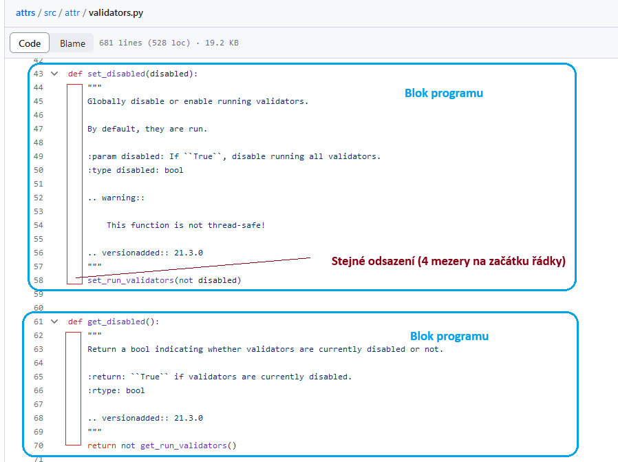

# Komentáře a bílé znaky v programu


Toto bude poměrně krátká kapitola.

## Bloky programu

Každý programovací jazyk člení svoje instrukce do větších celků.
Určité části programu spolu úzce souvisí, jsou spouštěny "spolu".
Programátor musí ty části programu, které spolu souvisí, nějakým způsobem
uspořádat, aby dal na vědomí, že "patří k sobě".

Různé jazyky to přitom dělají různě. 

Tak například: program napsaný v jazyce `C` bloky programu uzavírá zleva a zprava
do složených závorek. To, co je mezi složenými závorkami, je jeden blok programu.

Může to vypadat například takhle:

```c
int main() {  
    char c;
    
    printf("Enter a character: ");
    scanf("%c", &c);  
    
    // %d displays the integer value of a character
    // %c displays the actual character
    printf("ASCII value of %c = %d", c, c);
    
    return 0;
}
```

**Všimni si:**

- na začátku je blok programu, ohraničený zleva znakem `{` a zprava znakem `}` (složené závorky)
- každý příkaz programu je zakončený středníkem (`;`)
- všimni si těch dvou lomítek, a za nimi je nějaký text
  -  `// %d displays the integer value of a character`
  -  tohle je **komentář**. Je to poznámka, kterou si programátor do programu udělal, 
     aby se v něm lépe orientoval (aby byl čitelnější)
  - komentáře se ale "přeskakují", v programu se "nespouští"

Nějak takhle to dělá velké množství programovacích jazyků. Můžou používat trochu odlišnou 
konvenci pro označení začátku a konce bloku. Například:

```sql
REPLACE PROCEDURE CP_DTL_110_000_110000215_P(OUT out_Return_cd INTEGER )
BEGIN 
    DECLARE stat_code INTEGER;
    SET out_Return_cd=v_Stat_cd; 
END;
```

**Všimni si:**

- i zde se označuje začátek bloku (`BEGIN`) a konec bloku (`END`)
- i zde jsou příkazy zakončeny středníkem

V podstatě každý programovací jazyk potřebuje nějakou konvenci, pravidlo (syntaktické pravidlo),
které říká, kde začíná a kde končí jeho blok (část), a jak poznat začátek dalšího příkazu.

## Python a "významový bílý znak"

Python na to jde trochu jinak. V jazyce Python platí následující pravidla:

- blok programu se pozná podle toho, že má "na začátku stejný počet mezer", **má stejné "odsazení"**
- konec příkazu se pozná tak, že je zakončený řádek (pokud nejsme "uvnitř nějakých závorek")

Jazyk Python používá takzvaný "signifikantní whitespace" (významový bílý znak).

Co to znamená: znamená to, že následující program nepůjde spustit (můžeš si to vyzkoušet v Jupyteru).

```python
cislo = 1
 druhe_cislo = 2
```

**Vsimni si:** druhá řádka toho programu začíná mezerou. Pokud se pokusíš takový program spustit, Python ti vynadá,
a napíše ti něco jako:

```
IndentationError: unexpected indent
```

Dává ti tím na vědomí, že v tom místě (na začátku nové řádky) rozhodně mezeru nehledal.

Blok programu v jazyce Python může vypadat nějak takhle:



**Všimni si**:

- věci, které spolu souvisí, jsou "seskupené tak", aby byly u sebe
- všimni si slůvka `def` - tím je definovaná funkce (o tom víc později)
- příkaz `def set_disabled(disabled):` tedy definuje novou funkci nazvanou `set_disabled`
- jak ale Python pozná, kde ta funkce končí?
- pozná to jednoduše: všechny příkazy, které jsou od slova `def` odskočené doprava o stejný počet mezer, patří k té samé funkci

Dále si všimni, že v programu není ani jeden středník.

Příklad:

```python
def soucet(a, b): # první blok, funkce soucet, začíná zde
    return a + b  # součást prvního bloku

def nasobek(a, b): # tento řádek není odskočený doprava stejně jako předchozí blok
    return a * b   # a proto jsme nyní v dalším bloku programu

# tento řádek je na "stejné úrovni" jako oba řádky se slovem "def"
print(nasobek(2,2)) # vypíše 4
```

## Komentáře v jazyce Python

Pokud se na řádce najde znak mřížky, tak všechno za ní je komentář.
Ostatně, viz výše.

## Mezery? Tabulátory? Kolik mezer?

Specifikace jazyka říká jenom to, že ty řádky programu, které jsou odsazené stejným způsobem,
tvoří jeden blok programu. Neříká ale, kolik mezer by tam mělo být, nebo jestli použít mezeru, nebo tabulátor.

To znamená, že toto je platný program v jazyce Python.

```python
def perm(l):
    if len(l) <= 1:
                  return [l]        # všimni si: odskok vpravo, o HODNĚ znaků
                                    # to je sice matoucí, ale NENÍ to chyba
    r = []
    for i in range(len(l)):         # všimni si: tady začíná další blok
             s = l[:i] + l[i+1:]    # všimni si stejného odskoku doprava
             p = perm(s)
             for x in p:
              r.append(l[i:i+1] + x)
    return r
```

Toto ale **není** platný program v jazyce Python. Je to "stejný kód", ale plný chyb.

```python
 def perm(l):                       # chyba: nečekaný odskok doprava
for i in range(len(l)):             # chyba: zde se naopak očekává odskok, ale není to
    s = l[:i] + l[i+1:]
        p = perm(l[:i] + l[i+1:])   # chyba: nečekaný odskok doprava
        for x in p:
                r.append(l[i:i+1] + x)
            return r                # chyba: předchozí řádek je odskočený doprava o více znaků
                                    # ale je ještě stále součástí stejného bloku
```

Existuje (psaná) dohoda, že pro "odskok doprava" se mají používat **čtyři mezery**.
Ne tabulátory, a ani víc mezer než čtyři, ani méně.

V praxi to nicméně znamená, že pro "odskok doprava" budeš používat **klávesu Tab**.
Ta sice znamená "vlož tabulátor", ale drtivá většina programů, s jejichž pomocí
budeš psát kód, místo toho vloží právě ony čtyři mezery.

Nikdo tedy nečeká, že pro odsazení doprava budeš muset 4x po sobě stisknout 
na klávesnici mezerník - to by naopak byla chyba, protože takový postup člověk snadno
splete. Člověk není stroj, a dělá chyby.