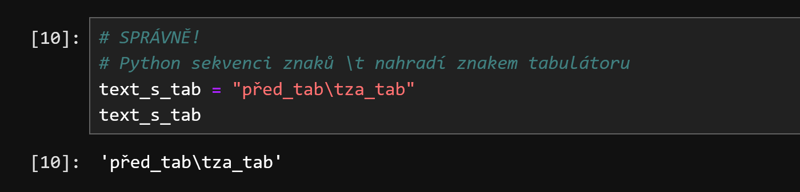
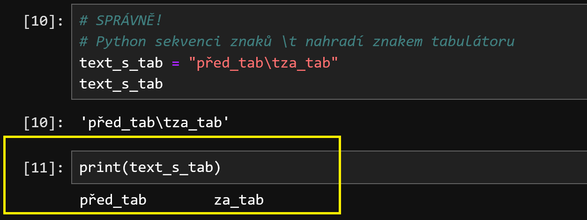
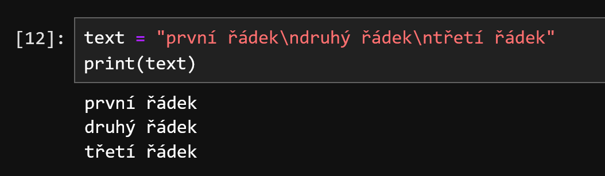

- [Text a práce s ním](#text-a-práce-s-ním)
  - [Nejdůležitější poznatky](#nejdůležitější-poznatky)
  - [Textové datové typy](#textové-datové-typy)
  - [str: jak text zadat do programu](#str-jak-text-zadat-do-programu)
    - [Uvozovky nebo apostrofy?](#uvozovky-nebo-apostrofy)
    - [Co když je oddělovač textu i uvnitř textu?](#co-když-je-oddělovač-textu-i-uvnitř-textu)
    - [Experiment 1: uvozovky uvnitř](#experiment-1-uvozovky-uvnitř)
    - [Text na více řádek](#text-na-více-řádek)
    - [Experiment 2: text na více řádek](#experiment-2-text-na-více-řádek)
    - [Escape sekvence](#escape-sekvence)
  - [Co se dá dělat s textovou hodnotou](#co-se-dá-dělat-s-textovou-hodnotou)
    - [Základní textové operátory](#základní-textové-operátory)
    - [Základní metody které textová hodnota poskytuje](#základní-metody-které-textová-hodnota-poskytuje)
    - [Formátovací řetězce: f-string](#formátovací-řetězce-f-string)
  - [Kontrolní otázky](#kontrolní-otázky)
  - [Zdroje](#zdroje)
    - [Česky](#česky)

# Text a práce s ním

## Nejdůležitější poznatky

TODO

## Textové datové typy

Pro práci s textem Python používá dva datové typy.

| datový typ | co to je                   |
| ---------- | -------------------------- |
| `str`      | text (string)              |
| `bytes`    | sekvence bytů, byte string |

Tato kapitola se zabývá pouze **prvním z nich**, a to datovým type `str`. Co je to byte string (datový typ `bytes`)
si povíme někdy jindy.

**Tato kapitola se zabývá pouze datovým typem str**.

Textová hodnota může vypadat nějak takhle - oba dva zápisy jsou v pořádku, a oba dva vytvoří stejnou hodnotu.

- `"tohle je text"`
- `'tohle je text`

## str: jak text zadat do programu

### Uvozovky nebo apostrofy?

Prvním poznatkem tedy je, že text v jazyce Python zleva a zprava ohraničíš buďto znakem 
uvozovek (`"text"`), nebo s pomocí apostrofů (`'text'`). Opravdu v tom není rozdíl. 
Který z těchto symbolů znaků použiješ je čistě otázkou osobní preference.

Vzhledem k existenci nástrojů, které mají programátorům usnadnit život (například: pomáhají
s formátováním kódu, aby _vypadal_ _pěkně_) - konkrétně, vzhledem k existenci programu
[black](https://black.readthedocs.io/en/stable/), bych ti doporučil držet se spíš použití
uvozovek. Autor tohoto formátovacího nástroje totiž tuhle svojí preferenci zhmotnil
v pravidlech, kterými se tenhle program řídí, a až ho jednou začneš používat, bude ti
"pod rukama" apostrofy měnit právě na uvozovky, což je nepříjemné.

### Co když je oddělovač textu i uvnitř textu?

Co když ale potřebuješ do textu (který jsi ohraničil uvozovkami), dostat znovu uvozovky?

Například: chceš do nové proměnné dostat následující text:


### Experiment 1: uvozovky uvnitř

- Zkus spustit Jupyter, a v adresáři `kapitola-06` založit nový notebook. 
- Rovnou ho ulož, a nazvi ho `lab-kapitola-06.ipynb`
- Do nové buňky zkus zadat (zkopíruj) následující příkaz, a buňku spusť.

```python
txt = "John řekl: "Půjdeme ve dvě hodiny.""
```

Dostal jsi chybu, která může vypadat nějak takhle:

```
 Cell In[2], line 1
    txt = "John řekl: "Půjdeme ve dvě hodiny.""
                       ^
SyntaxError: invalid syntax
```

Co se stalo? 

- Python narazil na uvozovky na začátku, a pochopil, že to co následuje, je text.
- Potom narazil na druhé uvozovky, a myslí si, že narazil na konec textu.

To znamená, že Python vidí něco jako:

- `txt = "John řekl:` - první instrukce
- `Půjdeme ve ...` - druhá instrukce, a slovů `Půjdeme` interpretru nic neříká.

**Správně** bys to mohl napsat nějak takhle. Zkus si to.

```python
txt = 'John řekl: "Půjdeme ve dvě hodiny."'
print(txt)
```

Tenhle program projde korektně.

**Závěr:**

- pokud si zvykneš používat pro oddělení textu uvozovky, pak apostrofy místo nich 
  použiješ tehdy, když jsou uvozovky uvnitř textu
- formátovače kódu jsou dostatečně chytré na to, aby to poznaly, a přizpůsobily se.

### Text na více řádek

Co když ale text potřebuješ z nějakého důvodu rozdělit na víc řádek?

Například: chceš do nějaké proměnné uložit následující text:

```
"Nesmím se bát. Strach zabíjí myšlení. 
Strach je malá smrt přinášející naprosté vyhlazení.
Budu svému strachu čelit. Dovolím mu, aby prošel kolem mne a skrze mne.
A až projde a zmizí, otočím se a podívám se, kudy šel. 
Tam, kam strach odešel, nic nezůstane. Zůstanu pouze já."
```

Zkusme to.

### Experiment 2: text na více řádek

Zkus v nové buňce spustit následující příkaz.

```python
text = "Nesmím se bát. Strach zabíjí myšlení. 
Strach je malá smrt přinášející naprosté vyhlazení.
Budu svému strachu čelit. Dovolím mu, aby prošel kolem mne a skrze mne.
A až projde a zmizí, otočím se a podívám se, kudy šel. 
Tam, kam strach odešel, nic nezůstane. Zůstanu pouze já."
```

Výsledkem je chyba, která asi vypadá nějak takhle:

```
  Cell In[7], line 1
    text = "Nesmím se bát. Strach zabíjí myšlení.
           ^
SyntaxError: unterminated string literal (detected at line 1)
```

Co se stalo?

- Python narazil na první znak uvozovek, a pochopil, že to co následuje, je text.
- Potom pokračoval na řádce doprava, až na není konec, a zjistil, že na konci uvozovky nejsou.
- Proto si stěžuje ... upozorňuje tě na to, že jsi nejspíš zapoměl text ukončit.


Pro tyhle případy existuje možnost místo **jedné** uvozovky (či apostrofu) použít
uvozovky **tři**. Správně tedy tenhle příkaz zapíšeš takhle (vyzkoušej to):

```python
text = """Nesmím se bát. Strach zabíjí myšlení. 
Strach je malá smrt přinášející naprosté vyhlazení.
Budu svému strachu čelit. Dovolím mu, aby prošel kolem mne a skrze mne.
A až projde a zmizí, otočím se a podívám se, kudy šel. 
Tam, kam strach odešel, nic nezůstane. Zůstanu pouze já."""
```


### Escape sekvence

Existují určité sekvence znaků, které nejdou na monitoru zobrazit. A často ani nejdou 
zadat na klávesnici. Nebo na klávesnici zadat jdou, ale jejich použití uvnitř textu by
porušilo syntaktická pravidla jazyka.

Takových znaků je spousta. Například tyhle (na ně narazíš nejčastěji):

| název     | escape | význam                                                                      |
| --------- | ------ | --------------------------------------------------------------------------- |
| CR        | `\r`   | _carriage_ _return_, znak, který posouvá kurzor na začátek řádky            |
| LF        | `\n`   | _line_ _feed_, znak, který zakončuje aktuální řádek                         |
| TAB       | `\t`   | tabulátor, znak, který znamená odskok kurzoru doprava (na začátku odstavce) |
| BACKSLASH | `\\`   | zpětné lomitko; z těchto je jediný "tisknutelný", a vypadá takhle: `\`      |
| uzovovky  | `\"`   | takhle můžeš dostat uvozovky do textu, který je ohraničený uvozovkami       |
| apostrof  | `\'`   | takhle můžeš dostat apostrof  do textu, který je ohraničený apostrofy       |

Když takový znak potřebuješ do textu vložit, musíš použít **escape** sekvenci.

To znamená, že když - například - potřebuju do textu dostat TAB, nemá smysl se ho snažit 
zapsat takhle:

```python
# ŠPATNĚ!
# napsal jsem uvozovky, a slovo před_tab
# stisknul jsem Tab na klávesnici
# napsal jsem za_tab a text jsem ukončil uvozovkami
text_s_tab = "před_tab  za_tab" 
```

**Správný** postup, jak takový znak do textu dostat, je zapsat místo něj "escape" sekvenci.

Tedy, zapsat ho takhle:

```python
# SPRÁVNĚ!
# Python sekvenci znaků \t nahradí znakem tabulátoru
text_s_tab = "před_tab\tza_tab" 
```

Vyzkoušej si to. Zadej v nové buňce ten druhý, správný zápis, a potom se podívej, co je
v proměnné text_s_tab. Mohlo by to vypadat nějak takhle:



**Všimni si:** 

- Ta escape sekvence se ti zobrazila i na výstupu.
- To, na co se díváš, je takzvaný `__repr__` _string_ - je to **interní reprezentace** 
  hodnoty, na kterou se proměnná `text_s_tab` odkazuje. O to, co to je `__repr__`, si
  řekneme něco víc později. 
- Prozatím postačí si zapamatovat, že když se na nějakou hodnotu (nebo proměnnou)
  podíváš to _zkratkou_, že ji přímo zadáš do buňky, nebo v interpretru, tak se díváš na
  její obraz, který může obsahovat "technické údaje"

Zkus si místo toho (v nové buňce) obsah proměnné vypsat pomocí příkazu `print`.

```python
print(text_s_tab)
```



**Všimni si:**

- Mezi oběma slovy (před, za) je docela dlouhá mezera.
- Ta mezera, to je právě tabulátor. 

**Všimni si:**

- podívej se ještě jednou na tabulku, která je uvedená nahoře. Na tu tabulku escape sekvencí.
- Všimnul sis, že je v ní uvedený znak `\n`, který znamená _ukončení_ _řádku_?
- Vzpomeň si, že ještě výše jsme se dívali na to, jak text rozdělit na více řádek - upozorňoval 
  jsem na možnost použít "tři páry uvozovek" místo jednoho páru uvozovek, pokud potřebuji 
  text roztáhnout na více řádek.
- To znamená, že stejného výsledku lze dosáhnout i s pomocí escape sekvence.

Netroufám si teď hodnotit, co je lepší. Hodně záleží na situaci.

Zkus si to:

```python
text = "první řádek\ndruhý řádek\ntřetí řádek"
print(text)
```



Problematika escape sekvencí není relevantní pouze pro Python. V podstatě stejné escape
sekvence se používají i v dalších jazycích.

Teď si přečti text na [tomto odkazu](https://cs.wikipedia.org/wiki/Escapov%C3%A1n%C3%AD), 
a potom se sem vrať.


## Co se dá dělat s textovou hodnotou

### Základní textové operátory

TODO

### Základní metody které textová hodnota poskytuje

TODO

### Formátovací řetězce: f-string

TODO

## Kontrolní otázky

Polož si prosím následující kontrolní otázky, a pokud neznáš odpovědi, přečti si text znovu (a vyzkoušej si příklady)

- jaké číselné datové typy znáš?
- co je to operátor, co je to operand?
- jak zapíšeš celočíselné dělení, jak zjistíš zbytek po celočíselném dělení?
- jak zjistíš datový typ, na který se odkazuje daná proměnná?
- jak můžeš převést datový typ `float` na `int`, a co se s tím číslem stane?
- co se stane, když se na `int` (nebo `float`) pokusíš převést něco, co se nechová jako číslo?

## Zdroje

### Česky

- - [Escapování](https://cs.wikipedia.org/wiki/Escapov%C3%A1n%C3%AD)