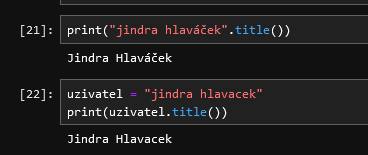

- [Text a práce s ním](#text-a-práce-s-ním)
  - [Nejdůležitější poznatky](#nejdůležitější-poznatky)
  - [Textové datové typy](#textové-datové-typy)
  - [str: jak text zadat do programu](#str-jak-text-zadat-do-programu)
    - [Uvozovky nebo apostrofy?](#uvozovky-nebo-apostrofy)
    - [Co když je oddělovač textu i uvnitř textu?](#co-když-je-oddělovač-textu-i-uvnitř-textu)
    - [Text na více řádek](#text-na-více-řádek)
    - [Escape sekvence](#escape-sekvence)
  - [Co se dá dělat s textovou hodnotou](#co-se-dá-dělat-s-textovou-hodnotou)
    - [Sloučení (konkatenace) a opakování textu](#sloučení-konkatenace-a-opakování-textu)
    - [Konverze na string](#konverze-na-string)
    - [Text se chová jako seznam jednotlivých znaků (iterable)](#text-se-chová-jako-seznam-jednotlivých-znaků-iterable)
    - [Přístup na konkrétní znak v textu (indexace)](#přístup-na-konkrétní-znak-v-textu-indexace)
    - [Imutabilita](#imutabilita)
    - [Slicing](#slicing)
    - [Délka](#délka)
      - [Cvičení 1: zadání úkolu](#cvičení-1-zadání-úkolu)
      - [Cvičení 1: hrubý návod](#cvičení-1-hrubý-návod)
    - [Text jako objekt: metody](#text-jako-objekt-metody)
      - [Text se dá formátovat](#text-se-dá-formátovat)
      - [Text se dá testovat](#text-se-dá-testovat)
      - [Text se dá rozdělit (a co bylo rozdělené se dá sloučit)](#text-se-dá-rozdělit-a-co-bylo-rozdělené-se-dá-sloučit)
      - [V textu se dá hledat](#v-textu-se-dá-hledat)
      - [V textu se dá nahrazovat\*\*](#v-textu-se-dá-nahrazovat)
      - [Metody se dají "řetězit"](#metody-se-dají-řetězit)
    - [Test na přítomnost hodnoty v textu](#test-na-přítomnost-hodnoty-v-textu)
  - [Kontrolní otázky](#kontrolní-otázky)
  - [Cvičení](#cvičení)
    - [Cvičení 1](#cvičení-1)
    - [Cvičení 2](#cvičení-2)
    - [Cvičení 3: šifra](#cvičení-3-šifra)
  - [Zdroje](#zdroje)
    - [Česky](#česky)
    - [Anglicky](#anglicky)

# Text a práce s ním

## Nejdůležitější poznatky

- text je ohraničený uvozovkami, nebo apostrofy; preferujeme uvozovky
- text na více řádek se dá napsat mezi tři uvozovky; `""" text na víc řádek """`
- co je to escape sekvence - nejdůležitější escape sekvence jsou: `"\n"`, `"\t"`, `\\`
- text (string) je **imutable**, dá se **skládat** (`+`) nebo **opakovat** (`"-" * 5`)
- text se chová jako kontejner: `"první písmenko"[0]`, `"první slovo"[0:5]`
- text má délku: `len("text má délku")`
- text má metody; protože je imutable, tak tyto metody vrací nový text 
  (nemění původní hodnotu); nejčastěji použijeme
  - `"  odstranění mezer ".trim()`
  - `"NA UPPERCASE".upper()`
  - `"na lowercase".lower()`
  - `"nÁhrada části textu".replace("Á", "á")`

## Textové datové typy

Pro práci s textem Python používá dva datové typy.

| datový typ | co to je                   |
| ---------- | -------------------------- |
| `str`      | text (string)              |
| `bytes`    | sekvence bytů, byte string |

Tato kapitola se zabývá pouze **prvním z nich**, a to datovým type `str`. Co je to byte string (datový typ `bytes`)
si povíme někdy jindy.

Textová hodnota může vypadat nějak takhle - oba dva zápisy jsou v pořádku, a oba dva vytvoří stejnou hodnotu.

- `"tohle je text"`
- `'tohle je text`

## str: jak text zadat do programu

### Uvozovky nebo apostrofy?

Prvním poznatkem tedy je, že text v jazyce Python zleva a zprava ohraničíš buďto znakem 
uvozovek (`"text"`), nebo s pomocí apostrofů (`'text'`). Opravdu v tom není rozdíl. 
Který z těchto symbolů znaků použiješ je čistě otázkou osobní preference.

Vzhledem k existenci nástrojů, které mají programátorům usnadnit život (například: pomáhají
s formátováním kódu, aby _vypadal_ _pěkně_) - konkrétně, vzhledem k existenci programu
[black](https://black.readthedocs.io/en/stable/), bych ti doporučil držet se spíš použití
uvozovek. Autor tohoto formátovacího nástroje totiž tuhle svojí preferenci zhmotnil
v pravidlech, kterými se tenhle program řídí, a až ho jednou začneš používat, bude ti
"pod rukama" apostrofy měnit právě na uvozovky, což je nepříjemné.

### Co když je oddělovač textu i uvnitř textu?

Co když ale potřebuješ do textu (který jsi ohraničil uvozovkami), dostat znovu uvozovky?

Například: chceš do nové proměnné dostat následující text: `John řekl: "Půjdeme ve dvě hodiny."`.

- Zkus spustit Jupyter, a v adresáři `kapitola-06` založit nový notebook. 
- Rovnou ho ulož, a nazvi ho `lab-kapitola-06.ipynb`
- Do nové buňky zkus zadat (zkopíruj) následující příkaz, a buňku spusť.

```python
txt = "John řekl: "Půjdeme ve dvě hodiny.""
```

Dostal jsi chybu, která může vypadat nějak takhle:

```
 Cell In[2], line 1
    txt = "John řekl: "Půjdeme ve dvě hodiny.""
                       ^
SyntaxError: invalid syntax
```

Co se stalo? 

- Python narazil na uvozovky na začátku, a pochopil, že to co následuje, je text.
- Potom narazil na druhé uvozovky, a myslí si, že narazil na konec textu.

To znamená, že Python vidí něco jako:

- `txt = "John řekl:` - první instrukce
- `Půjdeme ve ...` - druhá instrukce, a slovo `Půjdeme` interpretru nic neříká.

**Správně** bys to mohl napsat nějak takhle. Zkus si to.

```python
txt = 'John řekl: "Půjdeme ve dvě hodiny."'
print(txt)
```

Tenhle program projde korektně.

**Závěr:**

- pokud si zvykneš používat pro oddělení textu uvozovky, pak apostrofy místo nich 
  použiješ tehdy, když jsou uvozovky uvnitř textu
- formátovače kódu jsou dostatečně chytré na to, aby to poznaly, a přizpůsobily se.

### Text na více řádek

Co když ale text potřebuješ z nějakého důvodu rozdělit na víc řádek?

Zkusme to. Zkus v nové buňce spustit následující příkaz.

```python
text = "Nesmím se bát. Strach zabíjí myšlení. 
Strach je malá smrt přinášející naprosté vyhlazení.
Budu svému strachu čelit. Dovolím mu, aby prošel kolem mne a skrze mne.
A až projde a zmizí, otočím se a podívám se, kudy šel. 
Tam, kam strach odešel, nic nezůstane. Zůstanu pouze já."
```

Výsledkem je chyba, která asi vypadá nějak takhle:

```
  Cell In[7], line 1
    text = "Nesmím se bát. Strach zabíjí myšlení.
           ^
SyntaxError: unterminated string literal (detected at line 1)
```

Co se stalo?

- Python narazil na první znak uvozovek, a pochopil, že to co následuje, je text.
- Potom pokračoval na řádce doprava, až na není konec, a zjistil, že na konci uvozovky nejsou.
- Proto si stěžuje ... upozorňuje tě na to, že jsi nejspíš zapomněl text ukončit.

Pro tyhle případy existuje možnost místo **jedné** uvozovky (či apostrofu) použít
uvozovky **tři**. Správně tedy tenhle příkaz zapíšeš takhle (vyzkoušej to):

```python
text = """Nesmím se bát. Strach zabíjí myšlení. 
Strach je malá smrt přinášející naprosté vyhlazení.
Budu svému strachu čelit. Dovolím mu, aby prošel kolem mne a skrze mne.
A až projde a zmizí, otočím se a podívám se, kudy šel. 
Tam, kam strach odešel, nic nezůstane. Zůstanu pouze já."""
```


### Escape sekvence

Existují určité sekvence znaků, které nejdou na monitoru zobrazit. A často ani nejdou 
zadat na klávesnici. Nebo na klávesnici zadat jdou, ale jejich použití uvnitř textu by
porušilo syntaktická pravidla jazyka.

Takových znaků je spousta. Například tyhle (na ně narazíš nejčastěji):

| název     | escape | význam                                                                      |
| --------- | ------ | --------------------------------------------------------------------------- |
| CR        | `\r`   | _carriage_ _return_, znak, který posouvá kurzor na začátek řádky            |
| LF        | `\n`   | _line_ _feed_, znak, který zakončuje aktuální řádek                         |
| TAB       | `\t`   | tabulátor, znak, který znamená odskok kurzoru doprava (na začátku odstavce) |
| BACKSLASH | `\\`   | zpětné lomitko; z těchto je jediný "tisknutelný", a vypadá takhle: `\`      |
| uvozovky  | `\"`   | takhle můžeš dostat uvozovky do textu, který je ohraničený uvozovkami       |
| apostrof  | `\'`   | takhle můžeš dostat apostrof  do textu, který je ohraničený apostrofy       |

Když takový znak potřebuješ do textu vložit, musíš použít **escape** sekvenci.

To znamená, že když - například - potřebuji do textu dostat TAB, nemá smysl se ho snažit 
zapsat takhle:

```python
# ŠPATNĚ!
# napsal jsem uvozovky, a slovo před_tab
# použil jsem Tab na klávesnici
# napsal jsem za_tab a text jsem ukončil uvozovkami
text_s_tab = "před_tab  za_tab" 
```

**Správný** postup, jak takový znak do textu dostat, je zapsat místo něj "escape" sekvenci.

Tedy, zapsat ho takhle:

```python
# SPRÁVNĚ!
# Python sekvenci znaků \t nahradí znakem tabulátoru
text_s_tab = "před_tab\tza_tab" 
```

Vyzkoušej si to. Zadej v nové buňce ten druhý, správný zápis, a potom se podívej, co je
v proměnné text_s_tab. Mohlo by to vypadat nějak takhle:


**Všimni si:** 

- Ta escape sekvence se ti zobrazila i na výstupu.
- To, na co se díváš, je takzvaný `__repr__` _string_ - je to **interní reprezentace** 
  hodnoty, na kterou se proměnná `text_s_tab` odkazuje. O to, co to je `__repr__`, si
  řekneme něco víc později. 
- Prozatím postačí si zapamatovat, že když se na nějakou hodnotu (nebo proměnnou)
  podíváš to _zkratkou_, že ji přímo zadáš do buňky, nebo v interpretru, tak se díváš na
  její obraz, který může obsahovat "technické údaje"

Zkus si místo toho (v nové buňce) obsah proměnné vypsat pomocí příkazu `print`.

```python
print(text_s_tab)
```


**Všimni si:**

- Mezi oběma slovy (před, za) je docela dlouhá mezera.
- Ta mezera, to je právě tabulátor. 

**Všimni si:**

- podívej se ještě jednou na tabulku, která je uvedená nahoře. Na tu tabulku escape sekvencí.
- Všiml sis, že je v ní uvedený znak `\n`, který znamená _ukončení_ _řádku_?
- Vzpomeň si, že ještě výše jsme se dívali na to, jak text rozdělit na více řádek - upozorňoval 
  jsem na možnost použít "tři páry uvozovek" místo jednoho páru uvozovek, pokud potřebuji 
  text roztáhnout na více řádek.
- To znamená, že stejného výsledku lze dosáhnout i s pomocí escape sekvence.

Netroufám si teď hodnotit, co je lepší. Hodně záleží na situaci.

Zkus si to:

```python
text = "první řádek\ndruhý řádek\ntřetí řádek"
print(text)
```


Problematika escape sekvencí není relevantní pouze pro Python. V podstatě stejné escape
sekvence se používají i v dalších jazycích.

Teď si přečti text na [tomto odkazu](https://cs.wikipedia.org/wiki/Escapov%C3%A1n%C3%AD), 
a potom se sem vrať.

Zkus si ještě další příklad:

```python
print("zpětné uvozovky: \\")
print("text-před-tabulátorem-\t-text-za-tabulátorem")
```

**Zapamatuj si:** zpětné lomítko v textu (`\`) má speciální význam. Říká, že to co 
za ním následuje, je "speciální znak", který se má na výstupu (při vypsání na monitor)
"přeložit" na něco jiného.

## Co se dá dělat s textovou hodnotou

### Sloučení (konkatenace) a opakování textu

| operátor | příklad     | význam                        |
| -------- | ----------- | ----------------------------- |
| `+`      | `"a" + "b"` | sloučení, konkatenace; `"ab"` |
| `*`      | `"a" * 5`   | opakování (!!); `"aaaaa"`     |

Dvě textová hodnoty je možné sloučit, ale také je možné je opakovat.

Pojďme si to vyzkoušet. Zadej do notebooku - na novou buňku - následující program:

```python
veta_1 = "Nesmím se bát. Strach zabíjí myšlení."
veta_2 = "Budu svému strachu čelit. Dovolím mu, aby prošel kolem mne a skrze mne."

odstavec = veta_1 + "\n" + veta_2
print(odstavec)
```

**Všimni si:**

- v programu vzniká nová hodnota, která je sloučením tří textových hodnot
- tato hodnota je dostupná pod názvem (proměnnou) `odstavec`


Vyzkoušej si i opakování textu. Dejme tomu, že chceme nad textem a pod textem
zobrazit dlouhou "čáru". Chceme, aby byla tvořená z šedesáti pomlček.

```python
cara = "-" * 80
```

Zkus teď sám v notebooku program upravit tak, aby jeho výstup (to, co zobrazí `print`)
vypadal takhle:

```
--------------------------------------------------------------------------------
Nesmím se bát. Strach zabíjí myšlení.
Budu svému strachu čelit. Dovolím mu, aby prošel kolem mne a skrze mne.
--------------------------------------------------------------------------------
```

### Konverze na string

Co se stane, když se pokusíš sloučit string a číslo? Vyzkoušej si to:

```python
print ("tohle nejde" + 1)
```

Vyzkoušej si to.

Python ti "vynadá", zhruba takto: `TypeError: can only concatenate str (not "int") to str`

Říká ti, že můžeš sloučit (concatenate) pouze hodnotu typu `str` a `str`, ne `str` 
a `int` (číslo). Je to jako kdyby ses pokusil sečíst "hrušky a jablka".

Co by s tím měl Python udělat? Měl by se pokusit z textu `"tohle nejde"` udělat číslo,
a to přičíst k jedničce? Nebo z jedničky udělat string, a ten přidat k `"tohle nejde"`?

Python to neví. Neudělá tohle rozhodnutí za tebe.

Takže, pokud opravdu chceš ten text **sloučit** s tím číslem, musíš nejdřív číslo
**převést** na stejný datový typ. Takhle:

```python
print("tohle už jde" + str(1))
```

Vyzkoušej si to.

Na něco podobného jsme už narazili v části [Kapitola 5: Číselné proměnné, a operace s nimi](../kapitola-05/readme.md),
kde jsme si ukazovali konverzi z textu na číslo.

Ukazovali jsme si, že tohle selže, protože opravdu není žádný způsob, jak z toho textu udělat číslo.

```python
text = "příšerně žluťoučký kůň úpěl ďábelské ódy"
cislo = int(text)
```

Dále jsme si ukazovali, že tohle projde.

```python
text = "1"
cislo = int(text)
```

Pochopitelně to znamená, že projde i tohle - text na číslo, a zpátky na text.

```python
text = "1"
opet_text = str(int(text))
```

### Text se chová jako seznam jednotlivých znaků (iterable)

V jazyce Python je textová hodnota uložená jako "řetěz", nebo "šňůra" jednotlivých znaků 
(písmenek). Proto se také datovému typu pro uložení textu říká `str`, což je 
zkratka z anglického slova _string_ (šňůra, provázek).

Představ si jednotlivá písmenka jako korálky, které jsou na tom provázku navlečené.

- Každý provázek má začátek, a konec
- Když budeš počítat korálky na tom provázku, začneš na začátku, a přejdeš ten provázek na konec.

**Pamatuj si:** v jazyce Python je první položka seznamu vždy a pozici nula, ne na pozici jedna!

Představ si třeba následující text:

```python
pismena = "abcdefghijklmnopqrstuvwxyz"
```

Můžeš si představit, že v paměti je uložený nějak takhle (na následujícím "obrázku" je 
zobrazená jenom část toho textu).

```
| pozice :   0   1   2   3   4   5   6   7   8   9 
| --------   +---+---+---+---+---+---+---+---+---+
| pismeno:   | a | b | c | d | e | f | g | h | i |
| --------   +---+---+---+---+---+---+---+---+---+
```

- každé písmenko je vlastní "korálek" na provázku (je v paměti uložené samostatně)
- první písmenko je uložené na pozici nula **ne na pozici jedna**, jak bys asi čekal (Python čísluje řetězce - a vlastně všechny seznamy - od nuly, ne od jedničky)

Tahle kapitola tvrdí, že se text chová jako seznam jednotlivých znaků. Že je _iterable_, 
což lze (nešikovně) přeložit zhruba tak, že se dá _iterovat_, to znamená, že je možné ho
zpracovat položku po položce (písmenko po písmenku).

Zkus si to. Zadej v Jupyteru na nové buňce následující kód:

```python
pismena = "abcdefghijklmnopqrstuvwxyz"
for pismeno in pismena:
    print(pismeno)
```

Všimni si, že se každé písmenko vypsalo na samostatné řádce.

Současně jsme zde použili klíčové slovo `for`, o kterém si něco povíme v dalších lekcích.

Co zhruba dělá tenhle program?

- do paměti se uloží text `abcdefghijklmnopqrstuvwxyz`, a proměnná `pismena` na něj ukazuje
- potom se pro (`for`) každé `pismeno` ve stringu `pismena` toto písmeno vypíše (`print`) na obrazovku

### Přístup na konkrétní znak v textu (indexace)

Jak bys přistoupil na jedno konkrétní písmenko v tom textu?

Napsal bys něco jako:

```python
pismeno_c = pismena[2]
```

**Všimni si:**

- za názvem proměnné `pismena` jsou hranaté závorky. Tím programu říkáš, že chceš 
  přistoupit na konkrétní **index** (pozici) v daném stringu (řetězci)
- **Vzpomeň si:** Python indexaci provádí od pozice nula, ne od pozice jedna.
- Které písmeno je na pozici/indexu `2`?
  - písmeno `a` je na indexu nula
  - písmeno `b` je na indexu jedna
  - písmeno `c` je na indexu dva
- Python tedy v tomhle okamžiku vezme písmenko `c`, a **uloží ho na nové místo pozici v paměti**; 
  proměnná `pismeno_c` odkazuje na tuto novou pozici v paměti

Vyzkoušej si to:

```python
pismena = "abcdefghijklmnopqrstuvwxyz"
pismeno_c = pismena[2]
print(pismeno_c)
```

Možná ti pomůže také následující "obrázek".

```
  0   1   2   3   4   5   6   7   8   9 
  +---+---+---+---+---+---+---+---+---+
  | a | b | c | d | e | f | g | h | i |
  +---+---+---+---+---+---+---+---+---+

  ^
  |
  |
pismena
```

- představ si proměnnou `pismena` jako něco, co **ukazuje** na **začátek** stringu `abcdefghi`
- a teď si polož otázku: o kolik pozic musíš posunout ukazovátku, aby ukazovalo na začátek 
  buňky, ve které je písmeno `a`? Nikam ho posouvat nemusíš (posun o nulu). Proto říkáme,
  že písmenko `a` je od začátku stringu `0` pozic, což je onen **index**
- o kolik pozic od začátku stringu musíš posunout ukazovátko, aby ukazovalo na začátek buňky,
  ve které je uložené písmenko `c`? Musíš ho posunout o dvě pozice. Proto říkáme, že písmenko
  `c` je v tomto stringu na indexu 2 (`pismena[2]`)

**Index říká, o kolik pozic musíme posunout ukazovátko od začátku seznamu, abychom se dostali na požadovanou položku.**

Mimochodem: tento princip pochází z jazyka C, který zhruba takhle s textem zachází (možná
má ve skutečnosti ještě hlubší kořeny, nevím). Text je v tomhle programovacím jazyce 
uložený v paměti, každé písmenko zabírá jeden bajt (jednu buňku), a proměnná ukazuje 
na adresu prvního znaku. A k adrese se v jazyce C dá přičíst číslo, které říká, jak 
daleko v paměti se od ní posunout.

**Pozor:** není pravda, že jde o univerzální poznatek, který lze přenést na **všechny**
existující programovací jazyky. Některé programovací jazyky indexují seznam od jedničky, 
ne od nuly. Není jich mnoho, a nejsou tak moc rozšířené, ale existují (Algol, Fortran,
Lua, Smalltalk, ...)

### Imutabilita

Teď už víš, že s hodnotou, která je typu `str` (tj. string) můžeš zacházet tak, že dokážeš
získat konkrétní znak (písmenko) na konkrétní pozici (indexu). Víš také, že se texty dají
skládat dohromady (konkatenace, operátor `+`), víš, že se text dá opakovat (multiplikace, 
operátor `*`). 

Víš také, že se textová hodnota dá "přiřadit" do nějaké proměnné. Ale tohle tvrzení je 
vlastně nepřesné. Pamatuješ si ještě pořád, že **proměnná** je vlastně jenom "štítek",
že to je něco co se odkazuje na určité místo v paměti počítače? V případě hodnoty typu 
`str` je proměnná něco, co odkazuje "na začátek" toho textu.

Vyzkoušej si to. Zadej si tenhle kód do nové buňky (na konec), a spusť ho.

```python
pismeno_a = "a"
pismeno_b = "b"
pismeno_c = "c"
text = pismeno_a + pismeno_b + pismeno_c
print(text)
```

Poté, co jsi tenhle program spustil, Python interpretr si do paměti uložil celkem 
4 hodnoty.

| hodnota | proměnná  |
| ------- | --------- |
| `a`     | pismeno_a |
| `b`     | pismeno_b |
| `c`     | pismeno_c |
| `abc`   | text      |


Co když jsem se spletl, a chtěl bych, aby v mém textu místo `abc` bylo `aBc`?
Tedy, co když chci "doprostřed" toho textu uložit velké písmeno, místo malého písmena?

Už víš, že písmeno `b` je ve stringu, na který se odkazuje proměnná `text`, a indexu `1`.
Vyzkoušej si to.

```python
print(text[1])
```

Nabízelo by se tedy opravit jenom tohle jedno písmeno. Na pozici 1 v textu, na který se 
odkazuje proměnná `text`, uložit velké `B`. Zkus si to:

```python
text[1] = "B"
```

**Otázka:** co znamená to, co ti Python napsal v reakci na tenhle příkaz?
Zkus to přeložit, a doplň to na začátek buňky s tvým příkazem, takhle:

```python
# ___SEM__ doplň svůj překlad toho, co ti Python napsal zpátky
# tj jako komentář
text[1] = "B"
```

**Zapamatuj si:** datový typ `str` je **imutable**, v okamžiku kdy text sestavíš, 
nemůžeš ho už změnit (můžeš sestavit "nový" text, který obsahuje části původního textu).
Tohle je obrovský rozdíl oproti některým jiným programovacím jazykům, ve kterých to 
neplatí!

### Slicing

Z textu, na který se odkazuje nějaká proměnná, můžeš také vybrat jenom jeho část (_substring_).
Také se tomu může říkat  _slicing_, což můžeme přeložit zhruba jako _rozřezání_ textu na několik
částí. 

Vypadá to nějak takhle (zkus si to v nové buňce):

```python
pismena = "abcdefghijklmnopqrstuvwxyz"
print(pismena[2:6])
```

Pokud se nepletu, měl bys na výstupu vidět `cdef`. **Proč**?

```
| pozice :   0   1   2   3   4   5   6   7   8   9 
| --------   +---+---+---+---+---+---+---+---+---+
| pismeno:   | a | b | c | d | e | f | g | h | i |
| --------   +---+---+---+---+---+---+---+---+---+
|                    ^               ^
|                    |               |
|                    |   +-----------+
|                    |   |
| program:  pismena[ 2 : 6 ]
```

- V programu jsi napsal: `pismena[2:6]`
- tento zápis znamená zhruba tohle:
  - přistup na hodnotu na kterou se odkazuje proměnná `pismena`
  - ... posuň "ukazovátko" na pozici 2, a vrať všechno **od teto pozice** (včetně)
  - ... až do pozice 6 (to co je za pozicí 6 už nevracej)


### Délka

Pokud v jazyce Python chceš zjistit, jak je "něco" dlouhé, použiješ k tomu vestavěnou 
funkci [len](https://docs.python.org/3/library/functions.html#len).

Můžeš jí použít například nějak takhle:

```
delka = len("jak je dlouhý tenhle text?")
```


Dejme tomu, že chceme kolem našeho textu zobrazit rámeček. Měl by vypadat takhle:

#### Cvičení 1: zadání úkolu

```
--------------------------------------------------------------------------------
| Nesmím se bát. Strach zabíjí myšlení.                                        |
| Budu svému strachu čelit. Dovolím mu, aby prošel kolem mne a skrze mne.      |
--------------------------------------------------------------------------------
```

#### Cvičení 1: hrubý návod

- víme, že ta horní čára se skládá z 80 pomlček (stejně jako ta spodní)
- to znamená, že dokážeme spočítat, kolik mezer doplnit za každou větu tak,
  abychom "svislítko" na konci správně umístili
- k tomu ale potřebujeme znát **délku** první věty a délku druhé věty, a spočítat,
  kolik mezer nám na konci každé věty chybí

Pochopitelně bychom mohli ty mezery doplnit ručně. Ale o to nejde. 
Chceme si vyzkoušet základy manipulace s textem.

Jak tedy na to?

```python
# rámeček vlevo a rámeček vpravo
ram_vlevo = "| "
ram_vpravo = "|"
# jak je dlouhá čára nahoře?
delka_cary = len(cara)
# jak je dlouhá první věta?
delka_v1 = len(veta_1)
# kolik mezer potřebujeme doplnit? musíme započítat délku ohraničení zleva a zprava
mezer_v1 = delka_cary - delka_v1 - len(ram_vlevo) - len(ram_vpravo)
print(mezer_v1)
```

Teď tedy víme, kolik mezer potřebujeme doplnit na konec, a můžeme je "přidat na konec".

```python
veta_1_ramovana = ram_vlevo + veta_1 + (" " * mezer_v1) + ram_vpravo
```

Zkusíme, jestli se nám podařilo orámovat prvni větu správně.

```python
odstavec = cara + "\n" + veta_1_ramovana
print(odstavec)
```

Tohle bys měl teď vidět na výstupu:

```
--------------------------------------------------------------------------------
| Nesmím se bát. Strach zabíjí myšlení.                                        |
```

**Úkol**: Uprav program tak, aby jeho výstup vypadal tak, jak 
je popsáno v [Zadání úkolu](#cvičení-1-zadání-úkolu).


### Text jako objekt: metody

V této kapitole ses zatím dozvěděl, že:

- dva stringy je možné skládat (sčítat)
- string má délku, a chová se jako iterable
- string je možné "nařezat" na menší kousky (substring, slicing)
- string je imutable, jakmile jednou nějaký text vznikne, není možné ho již změnit
  (je možné vytvořit jeho kopii, a během její tvorby ji "mírně upravit")

Co jsme si zatím neřekli: text je **objekt**. Ve skutečnosti je **každá hodnota** v 
jazyce Python objekt.

Co je to objekt? Prozatím řekněme, že **objekt** je něco, co má:

- stav, to znamená že si objekt může něco o sobě "pamatovat"
- metody, to znamená, že objekt může něco "dělat"

Pojďme si to vyzkoušet. Zkus v notebooku tohle:

```python
print("jindra hlaváček".title())
```

```python
uzivatel = "jindra hlavacek"
print(uzivatel.title())
```



**Všimni si:**

- mám nějakou hodnotu, ať už je zapsaná přímo (`"jindra hlavacek"`), nebo jde o proměnnou (`jindra`)
- za ní napíšu tečku - tím říkám, že to co následuje je **metoda**, kterou chci použít
- název metody je `title`
- za názvem metody jsou závorky, tím říkám, že tu metodu chci **spustit**

Víc si o tom povíme později. V tomhle okamžiku bych ale chtěl uvést **některé** metody,
které má každý string (je jich o hodně víc než zde uvádím). 
Prosím, **vyzkoušej si** všechny zde uvedené příklady použití. To znamená, že 
si je zkusíš zadat do notebooku.


**Zapamatuj si:** protože je `str` _imutable_ datový typ, žádná metoda, kterou si zde
popisujeme, ho **nemění**. Každá z metod místo toho vrací nějakou (novou) hodnotu.
Takže, například, pokud se níže dočteš, že `"abcabc".replace("a","X")` nahrazuje písmenko
`a` písmenkem `X`, **původní text se nemění**, místo toho vzniká **nová** hodnota typu 
`str`, kterou můžeš přiřadit do proměnné.

Já osobně jsem s tímhle konceptem velmi, velmi zápasil (protože mám zkušenosti i z jiných
programovacích jazyků).

#### Text se dá formátovat

| metoda   | co dělá                                                                         | použití           | výsledek |
| -------- | ------------------------------------------------------------------------------- | ----------------- | -------- |
| `.strip` | vrátí kopii, očištěnou zleva a zprava o zadané znaky (bez zadání ořízne mezery) | `" abc ".strip()` | `"abc"`  |
| `.lower` | vrátí kopii, převedenou na malá písmena                                         | `"ABC".lower()`   | `"abc"`  |
| `.upper` | vrátí kopii, převedenou na velká písmena                                        | `"abc".upper()`   | `"ABC"`  |


#### Text se dá testovat

| metoda        | co dělá                                                   | použití                 | výsledek |
| ------------- | --------------------------------------------------------- | ----------------------- | -------- |
| `.endswith`   | vrátí `True` (pravda), pokud text končí zadanou hodnotou  | `"abc".endswith("c")`   | `True`   |
| `.startswith` | vrátí `True` (pravda), pokud text začíná zadanou hodnotou | `"abc".startswith("a")` | `True`   |


#### Text se dá rozdělit (a co bylo rozdělené se dá sloučit)

| metoda   | co dělá                                                              | použití              | výsledek          |
| -------- | -------------------------------------------------------------------- | -------------------- | ----------------- |
| `.split` | rozdělí text podle zadaného oddělovače (vrací seznam hodnot, `list`) | `"a,b,c".split(",")` | `['a', 'b', 'c']` |
| `.join`  | spojí něco, co lze iterovat                                          | `", ".join("abc")`   | `a, b, c`         |


#### V textu se dá hledat

| metoda  | co dělá                                                                                      | použití            | výsledek |
| ------- | -------------------------------------------------------------------------------------------- | ------------------ | -------- |
| `.find` | vrátí pozici (zleva), na které se v textu vyskytuje daná hodnota (vrací `-1` pokud tam není) | `"abc".index("Q")` | `-1`     |


#### V textu se dá nahrazovat**

| metoda     | co dělá                                                            | použití                     | výsledek |
| ---------- | ------------------------------------------------------------------ | --------------------------- | -------- |
| `.replace` | vrátí kopii, ve které najde a nahradí jednu hodnotu jinou hodnotou | `"abcabc".replace("a","X")` | `XbcXbc` |


#### Metody se dají "řetězit"

```python
print("a,b,c".upper().replace(".", " ")) # "A B C"
```

Tenhle krátký program nejdřív převede text `a,b,c` na velká písmena. Výsledkem je nová
hodnota typu `str` (text) - a i ta má "nějaké metody". Takže můžu použít třeba metodu
`replace` k tomu, abych v textu našel a nahradil všechny tečky mezerou.
Výsledkem je text `A B C`.


### Test na přítomnost hodnoty v textu

Pokud se potřebuješ zeptat, jestli v daném textu "něco je", a nezajímá tě "kde to je", 
zpravidla nepoužiješ metodu `.find`, ani `.index`. Použiješ místo toho operátor `in`.

Je to **čitelnější**, a lépe to vystihuje, o co ti vlastně jde.

```python
print ("bc" in "abc") # True
print ("BC" in "abc") # False - hledáme velké BC v textu který je uvedený malými písmeny
```

## Kontrolní otázky

Polož si prosím následující kontrolní otázky, a pokud neznáš odpovědi, přečti si text znovu (a vyzkoušej si příklady)

- jak zadat delší text, třeba na několik řádek?
- co se stane, když se pokusím dva texty "sečíst"? `print("a" + "b")`
- co se stane, když se pokusím text "vynásobit číslem"? `print("x" * 3)`
- co je to escape sekvence? Jak s pomocí escape sekvence dostat do textu konec řádky?
- jak z textu dostat nějakou jeho část? (slicing, nebo také substring)
- co to znamená, že je text _imutable_ ? 
- pamatuješ si některé metody, které text má?
- jak převést text na malá písmena? Jak ho převést na velká písmena?
- jak v textu nahradit nějakou jeho část jiným textem?

## Cvičení

### Cvičení 1

Viz [Cvičení 1: zadání úkolu](#cvičení-1-zadání-úkolu).

### Cvičení 2

Viz [Text jako objekt: metody](#text-jako-objekt-metody).

### Cvičení 3: šifra

Máš za úkol rozluštit tuhle šifru. Řešení ulož do stejného notebooku, ve 
kterém jsi doposud pracoval (a proveď jeho commit), a potom mi řekni, že máš hotovo.

Proč? Protože to co jsi dešifroval, to se stane.

```python
sifra = "32*56-7*892.20631"
```

Tady je šifrovací klíč.

| klíč  | hodnota |
| ----- | ------- |
| `"0"` | `"l"`   |
| `"1"` | `"u"`   |
| `"2"` | `"o"`   |
| `"3"` | `"d"`   |
| `"4"` | `"b"`   |
| `"5"` | `"t"`   |
| `"6"` | `"a"`   |
| `"7"` | `"e"`   |
| `"8"` | `" "`   |
| `"9"` | `"c"`   |
| `"-"` | `"n"`   |
| `"*"` | `"s"`   |
| `"."` | `"k"`   |

## Zdroje

### Česky

- [Escapování](https://cs.wikipedia.org/wiki/Escapov%C3%A1n%C3%AD)

### Anglicky

- [Built-in Functions: len](https://docs.python.org/3/library/functions.html#len)
- [Built-in Types: String Methods](https://docs.python.org/3/library/stdtypes.html#string-methods)