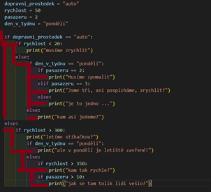

- [Větvení programu: klíčová slova if, elif, else](#větvení-programu-klíčová-slova-if-elif-else)
  - [Vývojový diagram](#vývojový-diagram)
  - [Klíčové slovo if](#klíčové-slovo-if)
  - [Klíčové slovo else](#klíčové-slovo-else)
  - [Klíčové slovo elif](#klíčové-slovo-elif)
  - [Zanoření bloků do sebe](#zanoření-bloků-do-sebe)
  - [Pokud program vypadá jako "schody", nejspíš není napsaný správně](#pokud-program-vypadá-jako-schody-nejspíš-není-napsaný-správně)
  - [Cvičení 1](#cvičení-1)
  - [Zdroje](#zdroje)
    - [Česky](#česky)

# Větvení programu: klíčová slova if, elif, else

Prakticky v každém programu narazíš na místo, kdy je třeba odlišně reagovat v odlišných
situacích. Je to součást takzvaného *control* *flow* programu.


## Vývojový diagram

Není to tak dávno, kdy programátoři nejdřív svoje programy svěřovali "papíru", a potom
teprve psali kód. Z té doby pochází zvyk vytvářet 
[vývojové diagramy](https://cs.wikipedia.org/wiki/V%C3%BDvojov%C3%BD_diagram).

Je dobré mít představu, jak takový vývojový diagram vypadá, takže na ten odkaz se určitě
podívej. Až budeš někdy řešit nějaký složitější problém, může se ti hodit si nejdříve
napsat (na papír) z jakých kroků se jeho řešení skládá, a potom si je "nakreslit" 
do podobného diagramu, a na jeho základě potom napsat kód který ten problém řeší.

Viz [diagram](https://cs.wikipedia.org/wiki/V%C3%BDvojov%C3%BD_diagram#/media/Soubor:Vyvojovy_diagram_zarovka.png) -
dokážeš na první pohled říct, o čem ten diagram je? Dokázal by ses podle něj zachovat?

Lidská mysl zkrátka funguje lépe, když se na daný problém "dokážeš podívat".

Existuje dokonce myšlenka takzvaného **vizuálního programování**, kdy program "nepíšeš",
ale "kreslíš" z jednotlivých stavebních bloků. Já osobně si myslím, že to je 
"hezký experiment", myslím si že má svoje místo ve výuce programování, ale tvrdím, 
že v praxi má tento přístup nehezké limity. 

## Klíčové slovo if

V předchozích kapitolách už jsi narazil na jednoduchý příklad větvení programu.
Je jím klíčové slovy `if` (*pokud*, *jestliže* *platí*)

```python
if 2 + 2 == 4:
    print("Pochopitelně platí, že 2+2 jsou 4.")
    print("Jen pro ilustraci: tohle je další řádek ve stejném bloku kódu")

print("A tenhle řádek se následně spustí bez ohledu na to, zda 2+2 jsou 4")
```

Všimni si: 

- za klíčové slovo `if` napíšeš nějaký "výraz".
- ten "výraz" může být skoro "cokoliv"
  - může to být nějaká podmínka (`2 + 2 == 4`)
  - může to být nějaká hodnota, která se "chová jako pravda" nebo "se chová jako nepravda",
    viz [kapitola o boolovské logice](../kapitola-07/readme.md#hodnoty-které-se-chovají-jako-pravdivé-či-nepravdivé)
  - může to být "nějaká funkce" (o tom víc později)
- za tím "výrazem" je dvojtečka. Tím říkáš intepretru, že tady onen výraz končí, a následuje
  blok kódu, který se má spustit, pokud se ten výraz vyhodnotí jako pravdivý.

## Klíčové slovo else

V rámci rozhodovací logiky můžeš ale také vykonat nějakou akci pokud podmínka "není" splněná.
K tomu slouží klíčové slovo `else` (*jinak*), které uvedeš za `if`.

```python
if 2 + 2 == 4:
    print("Pochopitelně platí, že 2+2 jsou 4.")
    print("Jen pro ilustraci: tohle je další řádek ve stejném bloku kódu")
else:
    print("Ale pokud by 2+2 nebylo 4, spustil by se tenhle kód.")
    print("A po něm také tenhle kód, protože je ve stejném bloku.")

print("A tenhle řádek se následně spustí bez ohledu na to, zda 2+2 jsou 4")
```

## Klíčové slovo elif

Někdy ti nestačí provést několik testů po sobě. Například, představ si situaci,
kdy si program "myslí" nějaké číslo, které bude větší než 0 ale menší než 100, a ty
potřebuješ nějak zareagovat na několik různých scénářů".

K tomu slouží klíčové slovo `elif`, což je zkrácenina z *else-if* (*jinak, pokud...*).

Mohlo by to vypadat nějak takhle (vyzkoušej si to).

```python
# netrap se tím, že nerozumíš tomu, co dělají tyhle tři řádky
# výsledek je ten, že rychlost_pohybu je náhodné číslo mezi 1 a 100
import random
random.seed()
rychlost_pohybu = random.randint(1,100)

if rychlost_pohybu < 20:
    print("Přidej, jedeme moc pomalu!")
elif rychlost_pohybu < 50:
    # pokud jsme tady, jedeme rychleji než 20 za hodinu, ale pomaleji než 50
    print("Jedeme něco mezi 20 a 50 kilometry za hodinu, vše v pořádku")
elif rychlost_pohybu < 80:
    # pokud jsme tady, jedeme rychleji než 50 za hodinu, ale pomaleji než 80
    print("Jedeme něco mezi 50 a 80 kilometry za hodinu, doufám že nejdeme na kole")
else:
    # pokud jsme tady, tak se nesplnila ani jedna z podmínek nahoře
    # takže, pokud je rychlost mezi 1 a 100, znamená to, že jedeme
    # přinejmenším 80 za hodinu
    print("Jedeme rychleji než 80 kilometrů za hodinu, jestli je to na kole...")
    print("... tak jsme nejspíš mrtví!")
```

## Zanoření bloků do sebe

Abych navázal na předchozí příklad. Představ si, že jedeš buď autem, nebo na kole.
Bezpečná rychlost na kole bude určitě menší, než bezpečná rychlost v autě... souhlasíš?

Pokud bys potřeboval napsat program, který zrychlí, nebo naopak zpomalí, a to podle toho
"čím jedeš", máš možnost podmínky do sebe zanořit. Mohlo by to vypadat například
nějak takhle:

```python
# netrap se tím, že nerozumíš tomu, co dělají tyhle 4 řádky
# rychlost_pohybu je náhodné číslo mezi 1 a 100
# a náhodně si určíme, jestli dopravní prostředek je auto, kolo, nebo motorový člun
import random
random.seed()
rychlost_pohybu = random.randint(1,100)
dopravni_prostredek = random.choice(["auto","kolo", "motorový člun"])

print("Dopravní prostředek je", dopravni_prostredek)
print("Rychlost pohybu je", rychlost_pohybu)
if dopravni_prostredek == "auto":
    if rychlost_pohybu <= 50:
        print("můžeme klidně přidat, jedeme pomaleji než 50 za hodinu")
    elif rychlost_pohybu <= 80:
        print("jedeme rychleji než 50, ale do 80 za hodinu je vše v pořádku")
    else:
        print("ZPOMAL!")
elif dopravni_prostredek == "kolo":
    if rychlost_pohybu <= 20:
        print("můžeme klidně přidat, jedeme pomaleji než 20 za hodinu")
    elif rychlost_pohybu <= 30:
        print("jedeme rychleji než 20, ale do 30 za hodinu je vše v pořádku")
    else:
        print("ZPOMAL!")
else:
    print("Ani auto, ani kolo ... takže asi plujeme po moři, že?")
```

## Pokud program vypadá jako "schody", nejspíš není napsaný správně

Když přimhouříš oči tak, aby se "ztratila" jednotlivá písmenka, ale pořád ještě
dokážeš sledovat "linie textu", máš přehled o jeho hrubé struktuře.

A pokud ta struktura "vypadá jako schody", nejspíš by měl program být přepsán.

Zatím pro to nemáš prostředky .... Nevíš jak na to. Takže se tím moc netrap. 
Ale ten princip **je platný**, zkus si ho zapamatovat.

Takhle tedy **pokud možno** ne ... Proč ne? Protože je tam příliš mnoho větví,
a pravděpodobně ani nedokážeš slovy popsat, "co se tam děje". A když to nedokážeš slovy 
popsat, je poměrně velká pravděpodobnost, že je tam chyba.... A pokud tam chyba není, tak
jí tam pravděpodobně zaneseš, až se k tomu programu za půl roku vrátíš, a budeš do něj
potřebovat udělat změnu.



## Cvičení 1

- překresli [tenhle program](#zanoření-bloků-do-sebe) do vývojového diagramu
- vyfoť ho, a fotku mi pošli (Whatsapp)
- ukážu ti, jak jí uložit na Git do adresáře `kapitola-08`

## Zdroje

### Česky

- [Wikipedia: vývojový diagram](https://cs.wikipedia.org/wiki/V%C3%BDvojov%C3%BD_diagram)
