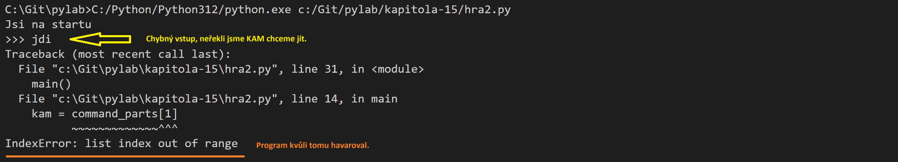

- [Píšeme textovku: první seance](#píšeme-textovku-první-seance)
  - [Struktura Python programu](#struktura-python-programu)
  - [Získání vstupu od uživatele, funkce input](#získání-vstupu-od-uživatele-funkce-input)
  - [Jednoduchá hra](#jednoduchá-hra)
  - [Definice místnosti jako dictionary](#definice-místnosti-jako-dictionary)

# Píšeme textovku: první seance

## Struktura Python programu

Každý spustitelný program v jazyce Python by měl obsahovat hlavní funkci, a měl by
si kontrolovat, že je spuštěný jako "hlavní program".

Kostra takového programu vypadá nějak takhle:

```python
def main():
    """
    Toto je hlavní funkce programu. Obsahuje základní logiku toho, co
    má program dělat.
    """
    pass

# Pokud je tento program spuštěný jako hlavní program (tj není "naimportován"
# z nějakého jiného místa), proměnná __name__ bude obsahovat hodnotu __main__.
# Podle toho poznáme, že jde o běžící program, a spustíme jeho hlavní funkci.
if __name__ == "__main__":
    main()
```

Povíme si o tom víc, až se do většího detailu ponoříme do klíčového slova `import`.

**Klíčový poznatek:** každ program v Pythonu by měl obsahovat podobnou konstrukci.

Informační zdroje:

- anglicky: [What Does if __name__ == "__main__" Do in Python?](https://realpython.com/if-name-main-python/)


## Získání vstupu od uživatele, funkce input

K získání vstupu od uživatele slouží funkce [input](https://docs.python.org/3/library/functions.html#input).

Funkci použijeme nějak takhle:

```python
command = input(">>> ")
```

Uživateli se zobrazí "tři zobáčky", a očekává se od něj, že zadá nějaký text, a stiskne
`Enter`. Náš program na tento text potom nějakým způsobem reaguje.

Například: tenhle program - viz [hra1.py](hra1.py) - poběží ta dlouho, dokud nezadáš `konec`.

```python
def main():
    while True:
        # získáme vstup od uživatele
        command = input(">>> ")
        # pokud napsal slovo "konec", končíme
        if command == "konec":
            print("Tak zase příště, ahoj!")
            return


if __name__ == "__main__":
    main()
```

## Jednoduchá hra

Na tomto základě jsme si ukázali jednoduchou hru. Existují dvě místnosti,
a je možné přejít z jedné do druhé.

Viz [hra2.py](./hra2.py).

Ukázali jsme si, jaké slabiny tento kód má:

- očekává, že příkaz zadáš vždy malými písmeny
- očekává, že mezy slovy bude vždy právě jedna mezera
- očekává, že za slovem `jdi` je vždy zadané minimálně ještě jedno další slovo

Ukázali jsme si, že program zhavaruje, pokud zadáš chybný vstup.



Řekli jsme si, že v jazyce Python se používá princip "je lepší prosit o odpuštění, než 
žádat o svolení", a že existuje něco jako `try/except` blok, který nám umožňuje odchytit
některé chyby, a nějak na ně reagovat.

```python
command = input(">>> ")

if command.startswith("jdi"):
    command_parts = command.split(" ")
    try:
        kam = command_parts[1]
    except IndexError:
        print("Neřekl jsi, kam chceš jít.")
        continue
```

Viz [hra2-try-except.py](./hra2-try-except.py)

## Definice místnosti jako dictionary

Ukázali jsme si, že je možné definovat místnost jako dictionary, což je
o něco složitější datová struktura, a že je možné mezi místnostmi definovat
přechody.

Vysvětlili jsme si, že tento postup modelování nějakého objektu z reálného světa
má svoje nevýhody: je "křehký", a může se snadno rozbít. Stačí v programu mít překlep,
(chybný název klíče) a program přestane dělat to co má. Naznačil jsem, že existuje
něco jako `objekt`, a na tohle se podíváme ve větším detailu příště.

Ukázali jsme si, že try/except blok může ešit víc chybových stavů najednou.

```python
try:
    # za slovem jdi bude mezera, a za ní bude místnost kam chceme jít
    command_parts = command.split(" ")
    # tohle může selhat, pokud command není složený aspoň ze dvou slov
    # chyba by byla IndexError
    kam = command_parts[1]
    # tohle může selhat, pokud místnost kam jdeme, není na mapě
    # chyba by byla KeyError 
    mistnost = MAPA[kam]
except IndexError:
    print("Neřekl jsi, kam chceš jít.")
except KeyError:
    print(f"Tam nemůžeš jít ({kam}), můžeš jít do", mistnost["vychody"])
```

Viz [hra3.py](./hra3.py).

