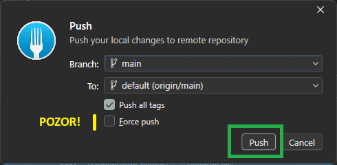

# Základy práce s Gitem

## Co je to Git?

Byl jednou jeden programátor (Linus Torvalds), který se rozhodl vytvořit vlastní **operační systém**.
To není jen tak "nějaká jednoduchá úloha". Z jeho snahy se zrodil operační systém **Linux**, který dnes používají
miliony lidí, a dokonce o tom ani nevědí. Dá se nejspíš říci, že Linux dnes "pohání internet". Dokonce i ten operační
systém, který běží na tvém telefonu, má svoje základy v Linuxu.

K dnešnímu dni se odhaduje, že samoné jádro Linuxu se skládá ze zhruba 27 milionů řádek. V tak velkém programu je snadné udělat
omylem nějakou hloupou chybu.

**Nebylo by báječné, kdyby se člověk mohl podívat, jak ta chyba vznikla?** S čím dalším ta chyba souvisí? Nebylo by prima,
kdyby autor měl možnost vrátit se v čase do bodu před vznikem té chyby?

Tak přesně tyhle úlohy pomáhá řešit **Git**. Git je vlastně takový stroj času. Je to systém pro správu verzí zdrojového kódu,
anglicky se tomu říká CVS (concurrent versioning system). Není to jediný systém tohoto typu, existují další takové systémy
(například SVN), ale systém Git je dns asi nejpoužívanější.

Tenhle text ostatně také čteš díky Gitu. Původně jsem ho napsal a vystavil na serveru [GitHub](https://github.com/jan-herout/pylab).
GitHub je služba, na kterou si můžeš odložit svou **repository**, a publikovat ji otevřeně do světa.

Co je to repository? Repository je úložiště zdrojového kódu, které sleduje jeho změny. Je to taková malá
[Alexandrijská knihovna](https://cs.wikipedia.org/wiki/Alexandrijsk%C3%A1_knihovna), ale najdeš v ní jenom informace o svém programu,
nic víc. A jenom to, co jsi do ní ty sám, nebo někdo jiný, kdo s tebou na programu spolupracuje, vložil.

Naučit se pracovat se systémem Git je něco, co by měl zvládnout každý programátor. Každý programátor by měl znát aspoň naprosté základy.
Rozebrat zde Git do detailu by bylo na dlouho. Zaměříme se jenom na to, co nutně potřebujeme k tomu, abys dokončil tento kurs.

## Jak Git vypadá?

Git je program ovládaný z příkazové řádky (programátoři _milují_ příkazovou řádku - tedy, někteří programátoři).
Je potřeba si pamatovat několik příkazů, kterými Git ovládáš.

Ve svojí podstatě ti tyto příkazy umožní (nemusíš se je teď naučit ovládat)

- založit si v repository "vlastní prostor" - `git checkout`
- uložit do repository změněný soubor (nějakou část programu) - `git add`, `git commit`
- podívat se na změny - `git log`, `git diff`
- publikovat změny, které jsi udělal - `git push`
- přijmout změny, které udělal někdo jiný `git pull`
- ... a mnoho dalších věcí

Git vypadá na příkazové řádce nějak takhle:

Na té obrazovce jsou vidět změny, provedené v jedné repository. Jsou tam vidět změněné soubory, smazané soubory, a dva soubory jsou nové (untracked files).

Protože tě nechci od začátku trápit složitou problematikou, budeš v tomhle kurzu místo příkazové řádky na práci s repository používat Git Fork.
Nicméně, měl by sis pamatovat několik důležitých termínů.

### Git repository

Repository je - jak jsem již psal výše - úložiště. Je to adresář na disku tvého počítače, ve kterém Git sleduje změny.

### Git commit

Commit je sada změn, které byly do repository uloženy najednou, ve stejném okamžiku. Každý commit má:

- **SHA hash**.
  - Je to vlastně takový identifikátor commitu, žádné dva commity nebudou mít stejnou SHA hash.
  - Můžeš si to představit jako takovou pečeť.
  - Představ si, že někomu píšeš dopis. Dopis napíšeš na 4 listy papíru, vložíš je do obálky,
    a potom obálku _zapečetíš_ - kápneš na ní trochu pečetního vosku, a otiskneš do něj svou _pečeť_.
  - Představ si, že jsi tu pečeť vyřezal ze dřeva, a potom spálil - nikdo jiný už nedokáže použít tu samou pečeť, nikdo jí už nikdy nedokáže vyřezat úplně stejně jako ty.
  - SHA hash je ten otisk ve vosku, kterým jsi zapečetil svoje čtyři listy papíru.
- **Autora** - to je asi zjevné.
- **Časové razítko** - kdy se ta změna stala.

Když budeš chtít "cestovat v čase", budeš vždy cestovat k "nějakému commitu". Budeš se vracet k tomu zamraženému stavu, který jsi svým commitem potvrdil.

### Git branch

Každá repository má alespoň jednu branch. Slovo _branch_ v angličtině znamená _větev_.

Zkus si představit svoje repository jako strom. Strom roste, tak jak do něj postupně přidáváš další a další commity. Za začátku je strom malý, a možná dokonce ani nemá žádné větve,
má jenom kmen... a potom, v nějakém okamžiku, se objeví první větev, která roste "mírně do strany".

Veverka by se po větvi dokázala vrátit zpátky ke kmeni, ale větev není identická se zbytkem stromu. Není stejná jako nějaká jiná větev, která na tom stromě je.

A to je přesně podstata toho, co je to _branch_ v Git repository. Je to prostor, který jsi v nějakém okamžiku "vyčlenil" od zbytku repository. Všechny soubory, které
v dané branchi máš, mají společný základ se zbytkem stromu, začínají ve stejném stavu, ale změny, které od toho okamžiku do repository přidáš, jsou součástí
té větve, na které právě jsi (ty jsi ta veverka, která se dokáže vrátit zpátky na kmen stromu).

Stejně jako ze stromu můžou růst pořád další a další větve, a z větví mohou vyrůstat menší větvičky, můžeš i v Git repository postupně vytvářet další a další branche.

Narozdíl od stromu ale Git dokáže branche znovu **slučovat**. Dokáže je spojit, a změny z jedné větve přidat do jiné větve, nebo ke "kmeni" (na hlavní branch).

Téhle hlavní branchi (kmeni) se dřív ríkávalo `master`, ale potom se svět zbláznil, a programátoři se rozhodli jí místo toho říkat `main`. Obě tyhle slova jsou zhruba ekvivalentní.

## Co je to Git Fork?

[Git Fork](https://git-fork.com/) je - slovy autora - rychlý, a přátelský Git klient. Je to vlastně program, který umí poslat Gitu tu "správnou sadu příkazů",
aby udělal "to co potřebuješ", a přitom změny vidíš hned na první pohled v grafickém rozhraní. V další textu budeme již používat jenom zkrácený název, **Fork**.

Měl bych asi zmínit, že Fork "není zadarmo". Ale neboj se, koupil jsem si pro sebe jeho licenci, a smím ho používat na dvou počítačích - na mém, a na tvém.

Fork vypadá nějak takhle:

Pojďme si teď rozebrat, co je co.

Všimni si, že jeho Fork je rozdělený na tři základní části.

- "Vpravo nahoře" je vidět síťový graf změn v repository. Asi to zní strašidelně, ale v podstatě to to ukazuje, kdy se co měnilo.
- "Vpravo dole" jsou vidět základní informace o commitu, na kterém právě stojíš (v pravé horní části je jeden "zašedlý řádek"), a to je ten commit
- "Vlevo" jsou vidět základní informace o repository, kterou máme otevřenou.

## Jak budeme s repository pracovat?

Protože cílem tohoto kurzu je, aby ses naučil hrubé základy, a abys dokázal prokázat práci, kterou jsi odvedl, budeš plody svého úsilí do téhle repository průběžně ukládat.

Na tvém počítači jsem tohle repository "naklonoval", zpřístupnil. V tomhle okamžiku je v něm pouze jedna branch, která představuje "kmen". Branch se jmenuje `main`,
a já ti na ní budu postupně připravovat další a další výukové texty.

Chceme ale tvojí práci oddělit od té mojí, takže potřebujeme založit **novou branch**, která bude **jenom tvoje**. Já ti na ní nic měnit nebudu,
pracovat s ní budeš jenom ty, tak jak půjde čas.

Pojďme na to.

### Spuštění Git Fork

Prvním krokem bude spustit si Git Fork. Klikneš na tlačítko "start" vlevo dole (taková ta ikonka Windows), a napíšeš `fork`.
Pokud jsi na pochybách jak na to, podívej se [sem, jak jsme spouštěli příkazovou řádku](),
ale místo `cmd` napíšeš `fork`.

Windows ti nabídnou program Git Fork, s obrázkem vidličky. Spusť ho.

Mělo by se ti otevřít okno, které vypadá podobně jako to moje (viz výše).

**Pokud ne**, pokud nevidíš proužek s repository `pylab`, musíš si to repository otevřít. Jaký proužek? Tenhle proužek.

### Otevření repository

Jak repository otevřít?

- Pokud ještě nemáš repository naklonované, musel bys ho nejdřív nakonovat, tj stáhnout ze serveru GitHub. Ale nemusíš, už jsem to pro tebe udělal.
- Stačí ti prostě ho otevřít.
  - Otevřít se anglicky řekne `Open`, a je na to klávesová zkratka (`Ctrl+O`), ale také nabídka `File/Open`
  - Otevře se ti okno pro výběr umístění z disku, a ty do něj napíšeš `c:\Git\pylab`, což je adresář, kam jsem repository naklonoval;
    potvrdíš klávesou `Enter`

### Založení nové branche

**Tuhle operaci provedeš jenom jednou.** Potřebujeme založit jednu novou branch, do které budeš ukládat (commitovat) svojí práci.
Branch by se měla jmenovat `student/tom-herout`.

Jak na to?

- za prvé, "pravým myšítkem" klikneš na branch s názvem `main`, zobrazí se ti kontextová nabídka
- vybereš z ní `New branch`, a do okénka které se ti objeví napíšeš `student/tom.herout` (nebo, pokud to čte **někdo jiný než ty, Tome**, napíše tam svoje jméno)

**Hint** - v názvech branchí se vyvaruj používání mezer, a českých znaků. Háčky a čárky nejsou fajn. A doporučuji všechno psát malými písmeny -
má to všechno rozumný důvod, ale do tohoto detailu zabíhat nebudu.

### Checkout branche

Před tím, než budeš ukládat/commitovat/potvrzovat jakékoliv změny, je potřeba si ověřit, že **jsi ve správné** (svojí, studentské) branchi.

Jak to poznáš? Podle "fajfky" vedle názvu branche.

Pokud by to tak nebylo, tak na tu svojí (studentskou) branch dvakrát rychle klikneš, aby ses na ní přepnul.

Pokud máš už v repository nějaké neuložené změny, Fork se tě zeptá, co s nimi udělat.

Co ti nabízí:

- `Stash and reapply` - schovat, a provést (aplikovat) znovu
- `Don't change` - dává ti možnost si to rozmyslet, a na branch se nepřepínat
- `Discard` - **zahodit změny** - tohle skoro určitě **nechceš udělat**, protože přijdeš o svojí rozdělanou práci

### Commit změn

Kontrola: jsi ve správné - ve svojí branchi? Určitě?

Pak můžeš do repository uložit změny. Tahle operace se skládá ze dvou kroků:

- `stage` - přenos změn do "přípravné oblasti"
- `commit` - potvrzení změn

Jak na to: nejdřív se musíš přepnout do `local changes`, což uděláš v levé části okna

Zobrazí se ti seznam změn. **ty soubory, které chceš upravit, označíš, a přesuneš do stage.** Všimni si, že si můžeš změny také prohlédnout,
abys měl jistotu, že ukládáš "smysluplné změny". Máš tady také možnost změnu odmítnout.

Podívej se na následující obrázek, a potom na text který jsem pod něj napsal.

**Všimni si:**

| barva ikonky | význam                                               |
| ------------ | ---------------------------------------------------- |
| žlutá        | soubor se mění, a "vpravo" je vidět co se v něm mění |
| zelená       | **nový** soubor                                      |
| červená      | **smazaný** soubor                                   |

Rozebereme si jaké změny v repository mám.

Zaprvé: na obrázku je vidět, že v souboru `kapitola-01/readme.md` se objevil **nový řádek**.
Je to ten text na zeleném pozadí, kde je napsáno, že to je chyba, kterou nechci přijmout.

Jak poznám, že je to nový řádek? Podle toho zeleného pozadí. Zelená barva - nový, červená barva - smazaný, žlutá barva - změna.

Tuhle změnu nechci přijmout, je to chyba, chci se jí zbavit. Jak se jí zbavím? Na soubor kliknu "pravým myšítkem", a zvolím 
`Discard changes`. Pozor, je to nevratná operace, buď si jistý že se té změny opravdu chceš zbavit!

Za druhé: vidím, že další změna je výmaz souboru `README.md`. Je vedle něj červená ikonka s mínusem.
Ani tuhle změnu nechci přijmout, je to chyba, a provedu pro ní `Discard changes` úplně stejným způsobem.

Za třetí - vidím tam sadu zelených ikonek s pluskem. Je to sada nových souborů (zelená = nový).
Podívám se, že **opravdu** všechny tyto soubory chci potvrdit a uložit. Pokud by mezi nimi byl nějaký,
který vznikl omylem, mám možnost se ho zbavit, smazat ho (`Discard changes`).

V tomto okamžiku tedy mám sadu nových souborů, které (všechny) chci uložit. Přesunu je do `Stage`.

Jak?

Můžu na ně jeden po druhém dvakrát kliknout. Přesunou se do spodní části obrazovky. Vypadalo by to nějak takhle:

Všimni si také toho tlačítka *Unstage*. Kdybych si to rozmyslel, můžu soubor "vrátit nahoru". **Jenom to, co Staged, bude v commitu.**

Nebo můžu nahoře označit všechny soubory, které chci do commitu přidat, a kliknout na tlačítko Stage.

Když mám ve Stage oblasti všechny změny, které chci poslat do commitu, tak vyplním krátkou zprávu k commitu, a stisknu tlačítko Commit.

Potom se podívám, že se commit objevil v síťovém grafu - v levé části obrazovky kliknu na `All commits`. Může to potom vypadat nějak takhle:

Všimni si, že se tam můj commit objevil.

### Zveřejnění změn

Když usoudím, že přišel čas změny "zveřejnit a pustit do světa", provedu dvě další operace.

- první z nich bude `Pull` - pokud by někdo jiný v repository (na mojí branchi)¨udělal nějaké změny, tak je tím k sobě zapracuji
- druhá z nich bude `Push` - tím všechny změny uveřejním

Na liště na obě tyhle operace má Fork docela velká tlačítka. Nejdřív provedu Pull, a potom Push.

U obou operací mi Fork dá možnost z nich "vycouvat". Vypadá to nějak takhle. Tohle je pro Pull.
Dej si pozor, aby **nebyla** zatržená možnost "Rebase instead of merge". Proč? O tom možná něco později.

Push vypadá nějak takhle. Dej si pozor, aby **nebyla** zatržená možnost `Forced push`. Proč? O tom možná něco později.

## A to je všechno

Tak, jak půjdeš tímto kurze, budeš pravidelně - podle svého uvážení - commitovat a uveřejňovat svojí práci.
A proč to všechno děláš?

Protože potom bude vidět, co všechno jsi udělal, a kdy. Zhruba nějak takhle:

- [na tvém profilu](https://github.com/tom-herout)
- [v repository](https://github.com/jan-herout/pylab/commits/main/)

## Zdroje

### Česky

- [Git Book: Stručná historie systému Git](https://git-scm.com/book/cs/v2/%C3%9Avod-Stru%C4%8Dn%C3%A1-historie-syst%C3%A9mu-Git)

### Anglicky

- [Linux in 2020: 27.8 million lines of code in the kernel, 1.3 million in systemd](https://www.linux.com/news/linux-in-2020-27-8-million-lines-of-code-in-the-kernel-1-3-million-in-systemd/)
