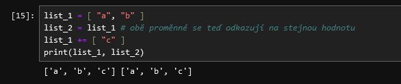

- [Imutabilita](#imutabilita)


# Mutabilita a imutabilita

Jak už víš, jazyk Python ti umožňuje uložit do paměti počítače hodnoty mnoha 
různých datových typů.

- [číselné datové typy](../kapitola-05/readme.md)
- [text, datový typ string](../kapitola-06/readme.md)
- TODO - list, dict, tuple, ....

Dále víš, že:

- Proměnná je něco jako "štítek", "ukazatel" na hodnotu, která je uložená v paměti.
- S hodnotami v paměti můžeš provádět různé operace (sčítání, odčítání, multiplikace, ...),
  a že výsledek těchto operací můžeš přiřadit do nějaké proměnné (že nějaká proměnná 
  může odkazovat na výsledek této operace)

Co ale zatím nevíš, je fakt, že některé z těchto hodnot v paměti měnit (mutovat) můžeš,
a jiné ne.

Podívejme se na jednoduchý příklad:

Mějme následující program - zkus si ho zadat do notebooku na novou buňku.

```python
_text = "a"
_text = _text + _text
```

Co tento program dělá?

- zakládá v paměti novou hodnotu `a`, a odkazuje se na ní proměnná `_text`
- potom provede složení těchto dvou hodnot, výsledkem je hodnota `aa`
- do proměnné `_text` uloží odkaz na tuto novou hodnotu

Python rozlišuje dva typy hodnot:

- hodnoty, které jsou **mutable**, tj jejich obsah se může měnit
- hodnoty, které jsou **imutable**, tedy neměnné, jejich obsah se **nemůže** změnit

Co to přesně znamená? čti dál.

## Co to znamená, když je hodnota imutable

Následující datové typy jsou imutable. Pokud některé z nich zatím nepoznáváš, 
netrap se tím.

- číselné datové typy: `int`, `float`
- "textové" datové typy: `str`, `bytes` (byte string)
- uspořádaná n-tice, neboli `tuple`

**Co to znamená?** Znamená to, že když do nějaké proměnné přiřadíš hodnotu tohoto 
datového typu, tak se v paměti počítače tahle hodnota už **nikdy nezmění**. 
Můžeš k této hodnotě přidat hodnotu jinou, můžeš s ní provést jakoukoliv operaci, ale
**vždy to vede k vzniku nějaké nové hodnoty**, nikdy ke změně té už existující hodnoty.

A to je přesně důvod, proč následující operace selže - klidně si to v následující buňce
vyzkoušej.

```python
_text[0] = "b"
```

Výsledkem je chyba:

```
TypeError: 'str' object does not support item assignment
```

Datový typ `str` je **iumutable** (stejně jako `int`, `float`, `tuple`), a jakmile 
jednou v paměti vzniknul, už jeho obsah nemůžeš měnit. Pamatuješ si ještě, že string
je vlastně "kontejner", že je _iterable_, a že můžeš přistoupit na jeho libovolnou pozici?

Přistoupit na ní můžeš, můžeš jí získat, ale **nemůžeš jí změnit.**

Pokud bys opravdu chtěl, aby v proměnné `_text` byla hodnota `ba`, musel bys to napsat jinak.
Například nějak takhle:

```python
_text = "a" # první řádek jsme nezměnili
_text = _text  + _text # ani druhý řádek jsme nezměnili
# ... ale teď chceme hodnotu, na kterou se _text odkazuje, opravit na "ba"
_text = "b" + _text[1:] # všechno od pozice jedna, až do konce
print(_text)
```

Může to vypadat, jako že měníme "obsah proměnné text". Ale ve skutečnosti se děje něco jiného.

- v paměti vznikne hodnota `a`, na kterou se proměnná `_text` odkazuje (přiřazení do proměnné)
- potom se hodnota `a` a hodnota `a` k sobě přidá, vzniká hodnota `aa`, a proměnná text se na ní odkazuje (přiřazení do proměnné)
- potom 
  - vzniká hodnota `b`, která se do žádné proměnné nepřiřazuje
  - z `aa` se vezme všechno od první pozice až do konce, což je `a`
  - `b` a `a` se spojí, vzniká hodnota `ba`
  - a proměnná `_text` se na ní odkazuje (přiřazení do proměnné)


**Hodnoty datových typů, které jsou imutable, nelze přímo měnit.** Je možné nad nimi 
provádět různé operace (přidat, odečíst, multiplikovat, ....), ale výsledkem je vždy 
**nová** hodnota, která je také imutable.

Znamená to ale ještě jednu věc. Dejme tomu, že máš následující program (vyzkoušej si ho)

```python
cislo_1 = 1 # vzniká nová hodnota 1
cislo_2 = cislo_1 # cislo_2 se odkazuje na stejnou hodnotu, jako cislo_1
cislo_2 = cislo_2 + 1 # navýšíme cislo_2 o jedničku
print(cislo_1, cislo_2) # ??? stane se něco s hodnotou v cislo_1 ???
```

Protože číslo (`int`, `float`) je **imutabilní**, neměnný datový typ, manipulace (změna)
s hodnotou v proměnné `cislo_2` nemá vliv na hodnotu v `cislo_1`.

- nejdřív se do proměnné `cislo_1` uloží odkaz na hodnotu `1`
- potom se stejný odkaz uloží do proměnné `cislo_2`
- potom na řádku `cislo_2 = cislo_2 + 1`:
  - nejdřív se přistoupí na hodnotu, na kterou se odkazu `cislo_2` (což je 1)
  - potom se tato hodnota zvedne o jedničku, vzniká hodnota 2, uloží se do paměti
  - do proměnné `cislo_2` se vloží odkaz na hodnotu 2
  - hodnota, na kterou se odkazuje `cislo_1` se **nemění**, protože `int` je imutabilní datový typ

Pro mutabilní hodnoty toto **neplatí** - dvě proměnné se mohou odkazovat na stejnou mutabilní 
hodnotu, a když potom tuto hodnotu změníš, tak se změna projeví pro obě proměnné. 

Tenhle poslední odstavec je extrémně důležitý. Jeho pochopení - respektive nepochopení - 
může být zdrojem nepříjemných chyb v programech, které budeš psát.

Srovnej (pokud zatím nevíš co je to _list_, nezoufej, včas se to dozvíš).

## Co to znamená, když je hodnota mutable

Když je hodnota mutable, znamená to, že je možné její obsah přímo změnit. Tato změna se
potom projeví **ve všech proměnných**, které s ní nějak nakládají. Toto je často zdrojem
nepříjemných, těžko odhalitelných chyb v programech. 

Které datové typy jsou mutable? V podstatě všechy datové typy, které nejsou označené 
jako imutable. Typicky to jsou "kontejnery", jako například `list`, `dict`, a podobně.

To znamená, že **mutabilní** (mutable) hodnoty jsou **všechny**, **kromě**

- čísel (`int`, `float`)
- textů (`str`, `byte`)
- uspořádaných n-tic (`tuple`, `collections.namedtuple`)

Vyzkoušej si to. Pokud nedokážeš přesně ten zápis níže přečíst, je to protože zatím
nevíš, co je to list - nezoufej, pochopíš.

```python
list_1 = [ "a", "b" ]
list_2 = list_1 # obě proměnné se teď odkazují na stejnou hodnotu
list_1 += [ "c" ]
print(list_1, list_2)
```



Všimni si: změnila se jak hodnota `list_1`, tak i hodnota `list_2`.